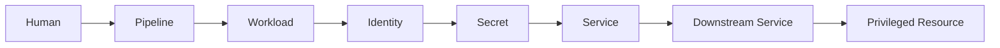
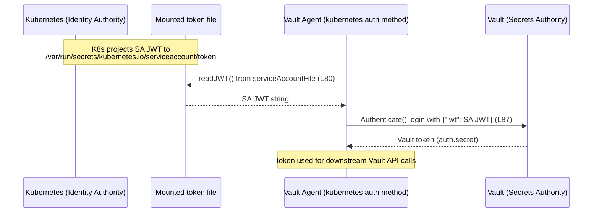
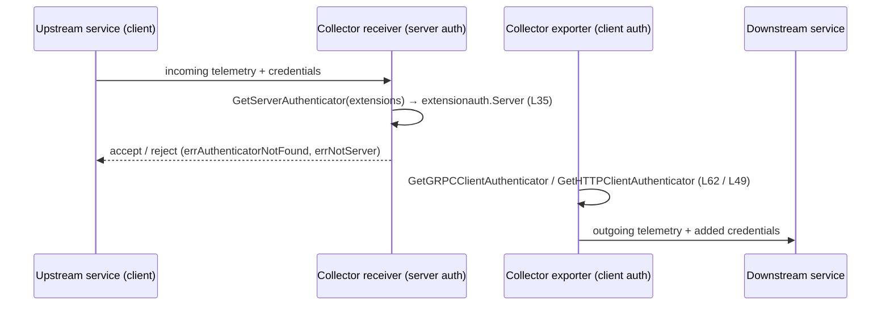
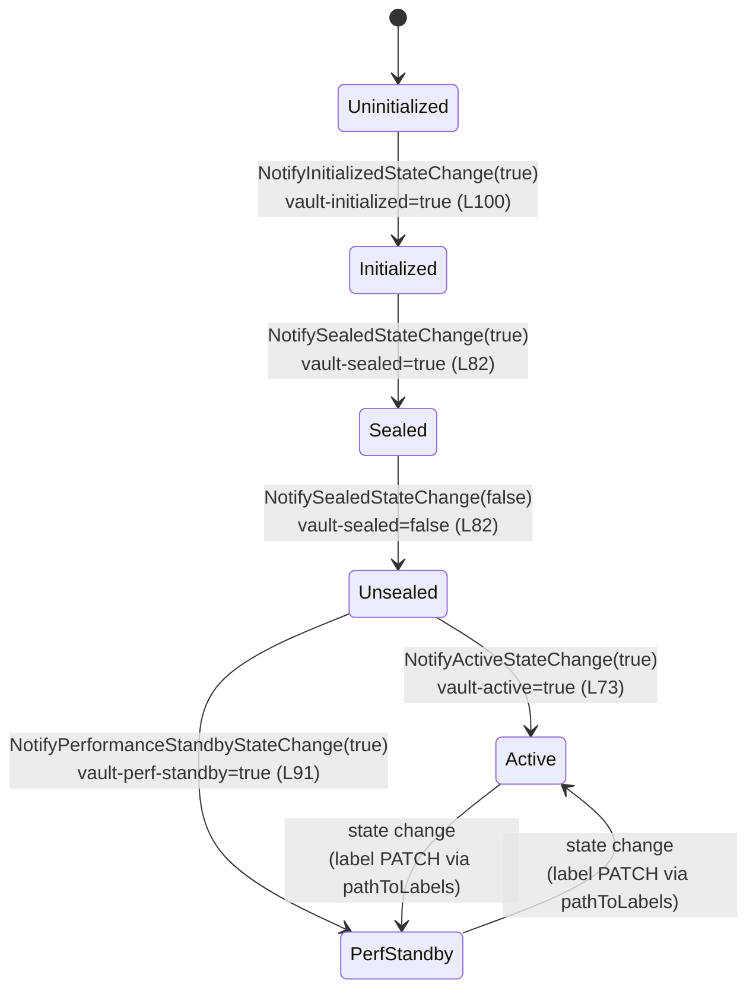
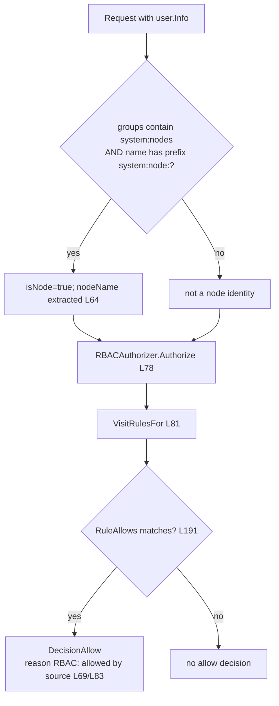
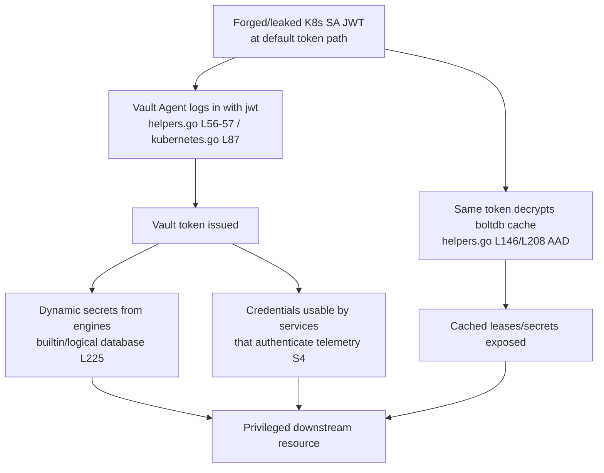
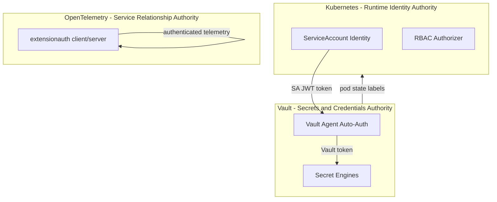
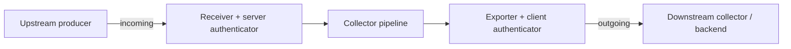

# Trust-Mesh Technical Specification — Kubernetes × Vault × OpenTelemetry

> **Preface.** This document realizes the Agent Action Plan (Technical Specification §0) by delivering its substantive output: an analytical reconstruction — built **exclusively from corpus evidence** — of how trust, authority, identity, credentials, secrets, permissions, service relationships, telemetry relationships, and privileged access propagate across the three trust domains assembled in this corpus. The corpus is treated as a single enterprise **trust mesh**, not as three independent products. The body below is sections §1–§9; §0 (the meta-plan) is not duplicated here.

---

## Conventions (read first)

This specification is governed by a small set of binding conventions, derived from the analytical requirements and applied uniformly throughout.

- **Corpus-evidence only.** Every claim about the existing system is grounded in repository source, configuration, manifests, interfaces, constants, authorization checks, authentication flows, integration points, retry behavior, validation gates, or security controls **inside this corpus**. Nothing outside the corpus is admissible.
- **Citation format.** Each system claim carries an inline citation of the form `` [`<path>:<locator>`] `` where `<path>` is corpus-relative and `<locator>` is a line range (`L25`, `L56-57`), a configuration key, or a directory reference. **No trust claim is admissible without a citation.**
- **Evidence classification.** Every material claim is tagged exactly one of:
  - **[Directly Observed]** — observable implementation behavior (a constant, a code path, a manifest value).
  - **[Inferred]** — a conclusion drawn by combining directly observed facts; not itself written in any single file.
  - **[Documented Assumption]** — a hypothesis or framing stated in corpus documentation that the implementation does not (and in this analytical construct cannot) confirm at runtime.
- **Prefer implementation over documentation.** Where a documentation claim conflicts with the implementation, the implementation wins, and the conflict is recorded as a high-value finding.
- **Analytical construct, not a deployment.** The three repositories are independent Git submodules. They are **not** configured, deployed, networked, or executed together anywhere in this corpus. No shared cluster, network, credential store, identity provider, service account, workload, or pipeline is assumed unless a specific artifact evidences it.

## Table of Contents

1. [Introduction](#1-introduction)
2. [Requirements & Traceability](#2-requirements--traceability)
3. [Technology Stack](#3-technology-stack)
4. [Process Flows](#4-process-flows)
5. [System Architecture](#5-system-architecture)
6. [Detailed Architecture](#6-detailed-architecture)
7. [UI Surfaces](#7-ui-surfaces)
8. [Infrastructure](#8-infrastructure)
9. [Appendices](#9-appendices)

---

## 1. Introduction

### 1.1 Corpus Overview and the Trust-Chain Spine

The corpus is described by its own root README as a combination of repositories "representing deployment authority, runtime identity, secret management, and service relationships," whose objective is "to analyze how trust, authority, credentials, and permissions may propagate across these domains" [`README.md:L1-12`] **[Directly Observed]**. The three repositories named there are Kubernetes, Vault, and OpenTelemetry [`README.md:L10-12`] **[Directly Observed]**.

The analytical spine for the **entire** specification is the eight-link trust chain asserted in the corpus hypothesis note [`docs/docs/TRUST_PROPAGATION_HYPOTHESIS.md:L3-10`] **[Documented Assumption]**:



The note frames this chain as a hypothesis and states the objective as determining "whether hidden trust relationships can be reconstructed automatically from enterprise software" [`docs/docs/TRUST_PROPAGATION_HYPOTHESIS.md:L12-16`] **[Documented Assumption]**. Every section that follows is organized to answer one question: *how does authority propagate across Kubernetes, Vault, and OpenTelemetry; what trust assumptions enable that propagation; and what privileged outcomes become possible?* The chain is the recurring backbone; §4.2 reconstructs each link against implementation evidence, and §1.2 maps the links to the three domains.

### 1.2 Trust Domains and Authority Roles

The corpus manifest assigns each repository a trust domain. The manifest's **literal** text is the short form [`Manifest.md:L3-10`] **[Directly Observed]**:

| Repository | Manifest literal text |
|------------|-----------------------|
| Kubernetes | "Trust Domain: Runtime Identity" [`Manifest.md:L3-4`] |
| Vault | "Trust Domain: Secrets & Credentials" [`Manifest.md:L6-7`] |
| OpenTelemetry | "Trust Domain: Service Relationships" [`Manifest.md:L9-10`] |

This specification refers to each domain by an **authority-role** name that extends the manifest's literal designation into an active role within the mesh. The authority-role naming is an analytical framing **[Inferred]** built on the manifest's literal text; it does not appear verbatim in `Manifest.md`. The mapping used throughout is:

| Trust Domain | Authority Role (analytical) | Manifest basis |
|--------------|-----------------------------|----------------|
| Kubernetes | **Runtime Identity Authority** | "Runtime Identity" [`Manifest.md:L3-4`] |
| Vault | **Secrets & Credentials Authority** | "Secrets & Credentials" [`Manifest.md:L6-7`] |
| OpenTelemetry Collector | **Service Relationship & Telemetry Authority** | "Service Relationships" [`Manifest.md:L9-10`] |

Each authority is the component that can independently establish, validate, grant, deny, propagate, or rely upon trust within its domain:

- **Kubernetes — Runtime Identity Authority.** It mints and names workload identities (service accounts) and node identities, and renders authorization decisions over them. Identity establishment is observable in `system:serviceaccount:` / `system:node:` naming and the RBAC authorizer (§4.7, §6.4).
- **Vault — Secrets & Credentials Authority.** It issues credentials through authentication methods and generates, leases, renews, and revokes secrets through secret engines (§6.2). It is also the consumer at the central seam: its Agent exchanges a Kubernetes-issued identity for a Vault token (§4.4).
- **OpenTelemetry Collector — Service Relationship & Telemetry Authority.** It mediates authenticated telemetry between services in both directions through its authenticator-extension contract (§4.4, §6.3).

### 1.3 Scope and Library Boundaries

**In scope.** The analytical reconstruction of trust propagation across the three domains, grounded in read-only evidence: the cross-domain seams, the identity and credential lifecycle, the per-seam liability analysis, the evidence-classified trust chain, and the diagram set. The evidence surfaces consulted are enumerated per section and consolidated in §2.5.

**Out of scope.** Any modification of source, configuration, or manifests inside `vault/`, `kubernetes/`, or `opentelemetry/`; creation or alteration of deployment wiring (no Helm, Kustomize, or Terraform is authored — `vault/terraform/` is itself a deprecation placeholder, see §8); runtime execution or instrumentation; and any invented cross-repository integration not directly evidenced.

**Library boundaries.** When reasoning about *integration possibilities* (as opposed to internal behavior observed for analysis), only `vault/api`, `vault/sdk`, and the Kubernetes `staging/src/k8s.io/*` trees are treated as supported import surfaces **[Documented Assumption]**. Other top-level module internals are read here strictly as evidence of behavior; they are not represented as stable, importable integration points. This caveat ensures the analysis does not misrepresent what a third party could build against.

### 1.4 License and Provenance Boundaries

License provenance differs across the domains, and this is a **liability/provenance** fact rather than a runtime fact:

- **Vault is BUSL-1.1.** Vault source files carry `SPDX-License-Identifier: BUSL-1.1` [`vault/command/agentproxyshared/helpers.go:L1-2`] **[Directly Observed]**, repeated across the Vault tree (e.g., [`vault/serviceregistration/kubernetes/service_registration.go:L1-2`]) **[Directly Observed]**.
- **Kubernetes is Apache-2.0.** Kubernetes source files carry the Apache License 2.0 header (e.g., [`kubernetes/staging/src/k8s.io/apiserver/pkg/authentication/serviceaccount/util.go:L1-15`], [`kubernetes/plugin/pkg/auth/authorizer/rbac/rbac.go:L1-15`]) **[Directly Observed]**.
- **OpenTelemetry is Apache-2.0.** OpenTelemetry source files carry `SPDX-License-Identifier: Apache-2.0` (e.g., [`opentelemetry/extension/extensionauth/doc.go:L1-2`]) **[Directly Observed]**.

The asymmetry matters for the mesh because the **single most consequential seam** (§4.4, §6.4) crosses a BUSL-1.1 boundary (Vault) into an Apache-2.0 boundary (Kubernetes): the accountable code that *consumes* a Kubernetes identity is Vault's, licensed differently from the code that *issues* that identity **[Inferred]**.

The submodule provenance is recorded in `.gitmodules`: `vault` → `vault.git`, `opentelemetry` → `opentelemetry-collector.git`, and `kubernetes` → `kubernetes.git`, all under the `blitzy-public-samples` organization [`.gitmodules:L1-9`] **[Directly Observed]**. The `.gitmodules` file records submodule paths and URLs but does **not** record commit pins; the pinned commits are held in the superproject's Git metadata, so "pinned submodule" is **[Inferred]** from the submodule mechanism rather than read from `.gitmodules` itself.

---

## 2. Requirements & Traceability

### 2.1 Analytical Requirement Framing

Because this is a trust-propagation analysis rather than a product, "requirements" are framed as **analytical capabilities the specification must reconstruct from evidence**, each carrying a Feature ID. A requirement is satisfied when its claim is grounded in a citation and tagged with an evidence class. Requirements are organized by where they sit on the trust chain (§1.1), not by product feature.

### 2.2 Trust-Domain Requirements

| ID | Capability | Primary Evidence | Class |
|----|------------|------------------|-------|
| **F-001** | Kubernetes acts as the Runtime Identity Authority (mints/names workload and node identities) | [`Manifest.md:L3-4`], [`kubernetes/staging/src/k8s.io/apiserver/pkg/authentication/serviceaccount/util.go:L29-56`] | Directly Observed |
| **F-002** | Vault acts as the Secrets & Credentials Authority (auth methods + secret engines) | [`Manifest.md:L6-7`], [`vault/builtin/credential/`], [`vault/builtin/logical/`] | Directly Observed |
| **F-004** | OpenTelemetry acts as the Service Relationship & Telemetry Authority | [`Manifest.md:L9-10`], [`opentelemetry/extension/extensionauth/doc.go:L4-6`] | Directly Observed |

### 2.3 Trust-Chain and Identity/Credential Requirements

| ID | Capability | Primary Evidence | Class |
|----|------------|------------------|-------|
| **F-003** | The eight-link trust chain (Human → … → Privileged Resource) is reconstructed against evidence | [`docs/docs/TRUST_PROPAGATION_HYPOTHESIS.md:L3-10`] (spine); per-link evidence in §4.2 | Documented Assumption (spine) / Directly Observed (links) |
| **F-005** | Vault issues credentials via authentication methods | [`vault/builtin/credential/`], [`vault/command/agentproxyshared/auth/auth.go:L28-34`] | Directly Observed |
| **F-006** | Vault generates leased, renewable, revocable dynamic secrets via secret engines | [`vault/builtin/logical/`], [`vault/builtin/logical/database/path_creds_create.go:L225`] | Directly Observed |
| **F-010** | Workload → Identity: Kubernetes service-account and node identity provenance | [`kubernetes/staging/src/k8s.io/apiserver/pkg/authentication/serviceaccount/util.go:L29-56`], [`kubernetes/pkg/auth/nodeidentifier/default.go:L37-64`] | Directly Observed |
| **F-015** | Kubernetes embeds audit provenance (issued-credential-id, pod/node) in identity establishment | [`kubernetes/staging/src/k8s.io/apiserver/pkg/authentication/serviceaccount/util.go:L38-50`] | Directly Observed |

### 2.4 Seam, Authorization, and Visibility Requirements

| ID | Capability | Primary Evidence | Class |
|----|------------|------------------|-------|
| **F-007** | Identity → Secret seam: Vault Agent consumes a Kubernetes service-account token to log in | [`vault/command/agentproxyshared/helpers.go:L25`], [`...helpers.go:L56-57`], [`vault/command/agentproxyshared/auth/kubernetes/kubernetes.go:L21`], [`...kubernetes.go:L80-87`] | Directly Observed |
| **F-008** | The same SA JWT serves a dual trust role: Vault login credential **and** boltdb persistent-cache AAD | [`vault/command/agentproxyshared/helpers.go:L97-102`], [`...helpers.go:L146`], [`...helpers.go:L208`], [`...helpers.go:L229-240`] | Directly Observed (paths) / Inferred (dual-role significance) |
| **F-009** | Vault → Kubernetes (reverse seam): operational state surfaced into pod labels | [`vault/serviceregistration/kubernetes/service_registration.go:L19-26`], [`...service_registration.go:L73-103`] | Directly Observed |
| **F-011** | Kubernetes RBAC renders allow decisions; default privileged bindings ship with the addon set | [`kubernetes/plugin/pkg/auth/authorizer/rbac/rbac.go:L78-83`], [`kubernetes/cluster/addons/rbac/`] | Directly Observed |
| **F-012** | OpenTelemetry authenticator extension authenticates incoming and outgoing telemetry | [`opentelemetry/extension/extensionauth/doc.go:L4-6`], [`opentelemetry/config/configauth/configauth.go:L26-69`] | Directly Observed |
| **F-013** | Telemetry transport trust is configured via TLS/opaque/gRPC/HTTP config packages | [`opentelemetry/config/configtls`], [`opentelemetry/config/configopaque`], [`opentelemetry/config/configgrpc`], [`opentelemetry/config/confighttp`] | Directly Observed |
| **F-014** | Vault audit pipeline logs request/response events through a broker to file/socket/syslog sinks | [`vault/audit/broker.go:L255`], [`...broker.go:L322`], [`vault/audit/backend_file.go`], [`vault/audit/backend_socket.go`], [`vault/audit/backend_syslog.go`] | Directly Observed |
| **F-016** | CI / image provenance: container build + cosign signing exist as build-time artifacts | [`vault/Dockerfile`], [`opentelemetry/.github/workflows/builder-snapshot.yaml:L39`] | Directly Observed |

### 2.5 Traceability Matrix

Each finding resolves to the evidence below. "Seam" links to the per-seam catalog in §6.4; "Flow" links to a diagram/flow in §4.

| ID | Resolves in | Seam / Flow | Evidence anchor | Class |
|----|-------------|-------------|-----------------|-------|
| F-001 | §1.2, §5.1 | — | [`Manifest.md:L3-4`]; [`.../serviceaccount/util.go:L29-56`] | Directly Observed |
| F-002 | §1.2, §6.2 | — | [`Manifest.md:L6-7`]; [`vault/builtin/credential/`]; [`vault/builtin/logical/`] | Directly Observed |
| F-003 | §4.2 | Spine | [`docs/docs/TRUST_PROPAGATION_HYPOTHESIS.md:L3-10`] | Documented Assumption / Directly Observed |
| F-004 | §1.2, §5.2 | — | [`Manifest.md:L9-10`]; [`.../extensionauth/doc.go:L4-6`] | Directly Observed |
| F-005 | §4.3, §6.2 | — | [`vault/builtin/credential/`]; [`.../auth/auth.go:L28-34`] | Directly Observed |
| F-006 | §6.2 | — | [`vault/builtin/logical/`]; [`.../database/path_creds_create.go:L225`] | Directly Observed |
| F-007 | §4.4, §6.4 | Seam S1 | [`.../helpers.go:L56-57`]; [`.../auth/kubernetes/kubernetes.go:L80-87`] | Directly Observed |
| F-008 | §4.4, §6.4 | Seam S1 | [`.../helpers.go:L97-102`], [`.../helpers.go:L146`], [`.../helpers.go:L229-240`] | Directly Observed / Inferred |
| F-009 | §4.6, §6.4 | Seam S5 | [`.../service_registration.go:L19-26`], [`.../service_registration.go:L73-103`] | Directly Observed |
| F-010 | §4.7, §6.4 | Seam S2 | [`.../serviceaccount/util.go:L29-56`]; [`.../nodeidentifier/default.go:L37-64`] | Directly Observed |
| F-011 | §4.7, §6.4 | Seam S3 | [`.../rbac/rbac.go:L78-83`]; [`kubernetes/cluster/addons/rbac/`] | Directly Observed |
| F-012 | §4.4, §6.3 | Seam S4 | [`.../extensionauth/doc.go:L4-6`]; [`.../configauth/configauth.go:L26-69`] | Directly Observed |
| F-013 | §6.3 | Seam S4 | [`.../config/configtls`]; [`.../config/configgrpc`]; [`.../config/confighttp`] | Directly Observed |
| F-014 | §6.5 | — | [`vault/audit/broker.go:L255`], [`.../broker.go:L322`]; transports in [`vault/audit/`] | Directly Observed |
| F-015 | §4.7, §6.5 | Seam S2 | [`.../serviceaccount/util.go:L38-50`] | Directly Observed |
| F-016 | §8 | — | [`vault/Dockerfile`]; [`opentelemetry/.github/workflows/builder-snapshot.yaml:L39`] | Directly Observed |

---

## 3. Technology Stack

### 3.1 Languages and Runtime Versions

All three domains are Go control-plane codebases. Their declared module paths and Go toolchain versions are read directly from each `go.mod`:

| Domain | Module path | Declared Go version | Evidence | Class |
|--------|-------------|---------------------|----------|-------|
| Vault | `github.com/hashicorp/vault` | **1.26.3** | [`vault/go.mod:L1`], [`vault/go.mod:L13`] | Directly Observed |
| Kubernetes | `k8s.io/kubernetes` | **1.26.0** | [`kubernetes/go.mod:L7`], [`kubernetes/go.mod:L9`] | Directly Observed |
| OpenTelemetry Collector | `go.opentelemetry.io/collector` | **1.25.0** | [`opentelemetry/go.mod:L1`], [`opentelemetry/go.mod:L11`] | Directly Observed |

> **Note on version semantics.** The `go` directive value (e.g., `go 1.26.3`) is the Go language/toolchain version declared by the module, not the product release version of Vault, Kubernetes, or the Collector. This specification reports the `go.mod` value verbatim and does not infer a product version from it **[Inferred]**.

### 3.2 Trust Anchors and Pinning

The three domains are assembled as Git submodules [`.gitmodules:L1-9`] **[Directly Observed]**. Submodule assembly pins each domain to a specific upstream commit recorded in the superproject's Git metadata; this pinning is the corpus's trust anchor for reproducibility of the analysis **[Inferred]**. No build is performed against these pins (see §3.3).

### 3.3 Build/Execution Posture

The corpus is an **analytical construct**: it is not built or executed as a combined system, and no runtime is provisioned anywhere in this effort. Consequently, no dependency is installed, upgraded, or resolved across domains, and no cross-domain binary is produced **[Directly Observed]** (absence of any cross-domain build manifest at the corpus root; the only root-level artifacts are `README.md`, `Manifest.md`, `.gitmodules`, and `docs/`).

### 3.4 Authentication and Authorization Surfaces (by domain)

- **Vault** — built-in authentication methods at `vault/builtin/credential/` (approle, aws, cert, github, ldap, okta, radius, token, userpass) [`vault/builtin/credential/`] **[Directly Observed]**; secret engines at `vault/builtin/logical/` (aws, consul, database, nomad, pki, pkiext, rabbitmq, ssh, totp, transit) [`vault/builtin/logical/`] **[Directly Observed]**; Vault Agent auto-auth methods at `vault/command/agentproxyshared/auth/` (alicloud, approle, aws, azure, cert, cf, gcp, jwt, kerberos, kubernetes, ldap, oci, token-file) [`vault/command/agentproxyshared/auth/`] **[Directly Observed]**.
- **Kubernetes** — service-account identity provenance at `kubernetes/staging/src/k8s.io/apiserver/pkg/authentication/serviceaccount/util.go` **[Directly Observed]**; node identity at `kubernetes/pkg/auth/nodeidentifier/default.go` **[Directly Observed]**; RBAC authorizer at `kubernetes/plugin/pkg/auth/authorizer/rbac/rbac.go` **[Directly Observed]**; default bindings at `kubernetes/cluster/addons/rbac/` **[Directly Observed]**.
- **OpenTelemetry** — authentication extension contract at `opentelemetry/extension/extensionauth/` **[Directly Observed]**; authenticator configuration wiring at `opentelemetry/config/configauth/`, with transport-trust packages `configtls`, `configopaque`, `configgrpc`, `confighttp` **[Directly Observed]**.

### 3.5 Diagram and Authoring Toolchain

This specification is authored in CommonMark / GitHub-Flavored Markdown with embedded **Mermaid** fenced blocks. Mermaid renders natively in Markdown hosts; offline rendering is optional via `@mermaid-js/mermaid-cli`. No documentation generator (`mkdocs`, `docusaurus`, Sphinx) is present at the corpus root, so there is no documentation build pipeline to wire into **[Directly Observed]**.

### 3.9 Trust-Propagation Technology Summary

Synthesizing §3.1–§3.5, the trust-relevant technology surface of the mesh is **[Inferred]**:

| Trust function | Bearing technology | Domain | Anchor |
|----------------|--------------------|--------|--------|
| Workload/node identity minting & naming | Go constants + identity helpers | Kubernetes | [`.../serviceaccount/util.go:L29-56`], [`.../nodeidentifier/default.go:L37-64`] |
| Authorization decision | RBAC authorizer (Go) | Kubernetes | [`.../rbac/rbac.go:L78-83`] |
| Identity-for-secret exchange | Vault Agent auto-auth (Go) | Vault (consumes K8s) | [`.../helpers.go:L56-57`], [`.../auth/kubernetes/kubernetes.go:L80-87`] |
| Secret generation/lease/renew/revoke | Secret engines (Go) | Vault | [`vault/builtin/logical/`] |
| Operational-state surfacing | Service registration PATCH (Go) | Vault → Kubernetes | [`.../service_registration.go:L73-103`] |
| Telemetry authentication (both directions) | `extensionauth` + `configauth` (Go) | OpenTelemetry | [`.../extensionauth/doc.go:L4-6`], [`.../configauth.go:L26-69`] |
| Credential-event visibility | Audit broker + sinks (Go) | Vault | [`vault/audit/broker.go:L255`] |
| Provenance / supply chain | Dockerfile + cosign workflow | Vault, OpenTelemetry | [`vault/Dockerfile`], [`.../builder-snapshot.yaml:L39`] |

---

## 4. Process Flows

### 4.1 Overview

This section reconstructs the trust chain (§1.1) as a process and then decomposes each cross-domain seam into its flow. A recurring caveat applies: the corpus does not wire the three domains together at runtime, so any claim that "the same workload" traverses multiple domains is an analytical assembly **[Inferred]**, while each individual mechanism (a token read, a login call, an authorization decision) is **[Directly Observed]** in a specific file.

### 4.2 Master Trust-Propagation Workflow

The eight-link spine, reproduced as the canonical reference:


Each link reconstructed against corpus evidence:

| Link | Reconstruction from evidence | Evidence | Class |
|------|------------------------------|----------|-------|
| **Human** | No corpus artifact binds a human actor into the runtime chain. The link is asserted only by the hypothesis note. | [`docs/docs/TRUST_PROPAGATION_HYPOTHESIS.md:L3`] | Documented Assumption |
| **Pipeline** | Build pipelines exist as CI workflows and a container build; binding them to the *runtime* trust chain is not evidenced (they are build-time). | [`opentelemetry/.github/workflows/builder-snapshot.yaml:L39`], [`vault/Dockerfile`] | Directly Observed (pipelines exist) / Documented Assumption (runtime binding) |
| **Workload** | A workload's identity material is the mounted service-account token at the default path `/var/run/secrets/kubernetes.io/serviceaccount/token`. | [`vault/command/agentproxyshared/auth/kubernetes/kubernetes.go:L21`] | Directly Observed |
| **Identity** | Kubernetes names the identity `system:serviceaccount:<ns>:<name>` (workloads) or `system:node:<name>` + group `system:nodes` (nodes). | [`.../serviceaccount/util.go:L29`,`L55-56`], [`.../nodeidentifier/default.go:L37`], [`.../user/user.go:L72`] | Directly Observed |
| **Secret** | Vault exchanges the identity (SA JWT) for a Vault token via the Agent's kubernetes auth method, and engines mint dynamic secrets. | [`.../helpers.go:L56-57`], [`.../auth/kubernetes/kubernetes.go:L80-87`], [`vault/builtin/logical/`] | Directly Observed |
| **Service** | The credential-bearing service authenticates telemetry on incoming requests via the authenticator extension. | [`.../extensionauth/doc.go:L4-6`], [`.../configauth.go:L35`] | Directly Observed |
| **Downstream Service** | An exporter adds authentication on outgoing requests to a downstream collector/backend. | [`.../extensionauth/doc.go:L4-6`], [`.../configauth.go:L62`] | Directly Observed |
| **Privileged Resource** | The privileged target is reached once a dynamic secret (e.g., DB credentials) is consumed or RBAC allows the action. | [`.../database/path_creds_create.go:L225`], [`.../rbac/rbac.go:L83`] | Directly Observed |

**Synthesis [Inferred].** Links *Workload → Identity → Secret* form a continuous, directly observed mechanism within and across the Kubernetes→Vault boundary. Links *Service → Downstream Service* are continuous within OpenTelemetry. The *Human* and *Pipeline* links are not bound to the runtime by any corpus artifact and remain Documented Assumptions; treating the full eight-link chain as one runtime path is therefore an analytical assembly, not an observed deployment.

### 4.3 Detailed Authentication and Secret Flows

**Vault Agent auto-auth contract.** The Agent's auto-auth abstraction is the `AuthMethod` interface: `Authenticate(context.Context, *api.Client) (string, http.Header, map[string]interface{}, error)`, plus `NewCreds()`, `CredSuccess()`, and `Shutdown()` [`vault/command/agentproxyshared/auth/auth.go:L28-34`] **[Directly Observed]**. The auth handler drives login by invoking `am.Authenticate(...)` [`vault/command/agentproxyshared/auth/auth.go:L331`] and signals success via `am.CredSuccess()` [`vault/command/agentproxyshared/auth/auth.go:L450`] **[Directly Observed]**. The method selected for a given configuration is resolved by a switch over the method type [`vault/command/agentproxyshared/helpers.go:L38-71`] **[Directly Observed]**.

**Auto-auth method inventory.** Thirteen methods are constructible: alicloud, approle, aws, azure, cert, cf, gcp, jwt, kerberos, kubernetes, ldap, oci, token-file [`vault/command/agentproxyshared/auth/`] **[Directly Observed]**, with `pcf` mapped to the `cf` constructor as a deprecated alias [`vault/command/agentproxyshared/helpers.go:L64-65`] **[Directly Observed]**.

**Credential issuance surface.** Vault server-side authentication methods (the credential-issuance surface) are approle, aws, cert, github, ldap, okta, radius, token, userpass [`vault/builtin/credential/`] **[Directly Observed]**.

**Dynamic secret lifecycle.** Secret engines mint dynamic secrets that are leased; the database engine, for example, returns a lease-bearing secret response via `b.Secret(SecretCredsType).Response(...)` [`vault/builtin/logical/database/path_creds_create.go:L225`] **[Directly Observed]**. The engine inventory (aws, consul, database, nomad, pki, pkiext, rabbitmq, ssh, totp, transit) [`vault/builtin/logical/`] **[Directly Observed]** spans generation (creds paths), and the PKI engine additionally exposes revocation surfaces (e.g., `path_acme_revoke.go`, `crl_util.go`) [`vault/builtin/logical/pki/`] **[Directly Observed]**. Generalized renewal/revocation semantics beyond these observed paths are **[Inferred]** from Vault's lease model and are not asserted here beyond the cited evidence.

### 4.4 Integration Sequence Diagrams

#### 4.4.1 Identity → Secret (the central seam)

The Vault Agent reads the Kubernetes service-account JWT and submits it as the `"jwt"` field of a Vault login, receiving a Vault token. The default token path is observed directly:

```go
// vault/command/agentproxyshared/auth/kubernetes/kubernetes.go:L21
serviceAccountFile = "/var/run/secrets/kubernetes.io/serviceaccount/token"
```



Sequence anchors: `readJWT()` at [`vault/command/agentproxyshared/auth/kubernetes/kubernetes.go:L80`]; the `"jwt"` login payload at [`...kubernetes.go:L87`]; method construction at [`vault/command/agentproxyshared/helpers.go:L56-57`] **[Directly Observed]**.

**Dual-use finding (F-008).** The *same* default token path is read by a *second*, independent code path: when the Agent's persistent cache is `type: "kubernetes"`, `getServiceAccountJWT(...)` reads the SA token and uses it as **AAD** (additional authenticated data) to bind the boltdb persistent cache's encryption [`vault/command/agentproxyshared/helpers.go:L97-102`], [`...helpers.go:L146`], [`...helpers.go:L208`], [`...helpers.go:L229-240`] **[Directly Observed]**. Thus one Kubernetes-issued artifact carries two distinct trust functions — a *login credential* and a *cache-encryption parameter* — a non-obvious coupling analyzed for liability in §6.4 **[Inferred]**.

#### 4.4.2 Service ↔ Downstream Service (OpenTelemetry authenticated telemetry)

The `extensionauth` package "ensure[s] authentication on incoming requests, and allows exporters to add authentication on outgoing requests" [`opentelemetry/extension/extensionauth/doc.go:L4-6`] **[Directly Observed]** — i.e., it is bidirectional, spanning a server side and a client side. The `configauth.Config` selects the authenticator extension by ID and resolves it to a server or client authenticator:



Resolution anchors: `GetServerAuthenticator` → `extensionauth.Server` at [`opentelemetry/config/configauth/configauth.go:L35`]; `GetHTTPClientAuthenticator` → `extensionauth.HTTPClient` at [`...configauth.go:L49`]; `GetGRPCClientAuthenticator` → `extensionauth.GRPCClient` at [`...configauth.go:L62`]; the authenticator is named by `AuthenticatorID component.ID` (`mapstructure:"authenticator,omitempty"`) at [`...configauth.go:L26-28`] **[Directly Observed]**.

### 4.6 Vault → Kubernetes State Surfacing (reverse-direction seam)

In the reverse direction, Vault writes its own operational state **into** Kubernetes pod labels. The label keys and the patch path are constants:

```go
// vault/serviceregistration/kubernetes/service_registration.go:L26
pathToLabels = "/metadata/labels/"
```

The five state labels are `vault-version`, `vault-active`, `vault-sealed`, `vault-perf-standby`, and `vault-initialized` [`vault/serviceregistration/kubernetes/service_registration.go:L19-23`] **[Directly Observed]**. Four `Notify*` methods PATCH the corresponding label when state changes: `NotifyActiveStateChange` [`...service_registration.go:L73`], `NotifySealedStateChange` [`...service_registration.go:L82`], `NotifyPerformanceStandbyStateChange` [`...service_registration.go:L91`], and `NotifyInitializedStateChange` [`...service_registration.go:L100`] **[Directly Observed]**. A retry handler provides resilience for these updates, exposing `Run` [`vault/serviceregistration/kubernetes/retry_handler.go:L48`], `Notify` [`...retry_handler.go:L110`], and `updateState` [`...retry_handler.go:L224`] **[Directly Observed]**.



The diagram is an analytical assembly of the four independently observed `Notify*` transitions and the label set; the precise ordering of transitions is **[Inferred]** from the label semantics, while each labeled edge maps to a directly observed method.

### 4.7 RBAC and Node-Identity Decision Flow

Two Kubernetes gates govern whether an identity is recognized and then authorized.

**Node-identity gate.** `NodeIdentity(u)` returns `isNode=true` **only if** the user's groups contain `system:nodes` **and** the username has the prefix `system:node:`; it then extracts the node name by trimming that prefix [`kubernetes/pkg/auth/nodeidentifier/default.go:L42-64`] **[Directly Observed]**. The group constant `NodesGroup = "system:nodes"` is defined in the user package [`kubernetes/staging/src/k8s.io/apiserver/pkg/authentication/user/user.go:L72`] **[Directly Observed]**; the username prefix `nodeUserNamePrefix = "system:node:"` is local to the identifier [`kubernetes/pkg/auth/nodeidentifier/default.go:L37`] **[Directly Observed]**. Both conditions are required — a matching name without the group, or the group without the matching name, does not yield node identity **[Directly Observed]**.

**Authorization gate.** `RBACAuthorizer.Authorize(...)` visits applicable rules via `VisitRulesFor(...)` and, on a match, returns `authorizer.DecisionAllow` with the reason string `"RBAC: allowed by <source>"` [`kubernetes/plugin/pkg/auth/authorizer/rbac/rbac.go:L78-83`], [`...rbac.go:L69`] **[Directly Observed]**. The core predicate is `RuleAllows(...)` [`...rbac.go:L191`] **[Directly Observed]**. RBAC is allow-on-match: absence of a matching allow rule does not produce an allow decision **[Directly Observed]**.



**Default privileged bindings.** The addon set ships default RBAC bindings: `cluster-autoscaler`, `cluster-loadbalancing`, `kubelet-api-auth`, `kubelet-cert-rotation`, `legacy-kubelet-user`, and `legacy-kubelet-user-disable` [`kubernetes/cluster/addons/rbac/`] **[Directly Observed]**. These represent privilege that exists by default rather than by explicit per-cluster grant; their security implications are catalogued in §6.4.

### 4.10 Cross-Domain Synthesis and Liability Cascade

Tying the seams together: a Kubernetes-issued identity (S2) is consumed by Vault to mint a token (S1) that unlocks dynamic secrets reaching privileged resources, while Vault's state flows back into Kubernetes labels (S5) and OpenTelemetry authenticates the service-to-service edges (S4). The compromise cascade — the propagation of a single forged or leaked upstream assertion — is:



The cascade is **[Inferred]** from the directly observed seam mechanisms; it is an analytical "what-if," not an observed exploit. The accountable-system analysis for each leg is given per-seam in §6.4.

---

## 5. System Architecture

### 5.1 Domains as Components and the Seam Map

The mesh is three authority components joined by cross-domain seams. The component-and-seam map is the canonical architecture reference:



Component responsibilities and their evidence anchors:

| Component | Responsibility | Anchor | Class |
|-----------|----------------|--------|-------|
| ServiceAccount Identity (K8s) | Mint/name workload identities | [`.../serviceaccount/util.go:L29-56`] | Directly Observed |
| RBAC Authorizer (K8s) | Render allow decisions | [`.../rbac/rbac.go:L78-83`] | Directly Observed |
| Vault Agent Auto-Auth (Vault) | Exchange identity for a Vault token | [`.../helpers.go:L56-57`], [`.../auth/kubernetes/kubernetes.go:L80-87`] | Directly Observed |
| Secret Engines (Vault) | Generate/lease dynamic secrets | [`vault/builtin/logical/`] | Directly Observed |
| `extensionauth` (OTel) | Authenticate telemetry both directions | [`.../extensionauth/doc.go:L4-6`] | Directly Observed |

The edges are the seams catalogued in §6.4: `SA → AGENT` (S1/S2), `AGENT → ENGINES` (internal to Vault but on the secret-issuance path), `VAULT → K8S` pod labels (S5), and the `AUTHEXT ↔ AUTHEXT` self-edge denoting that one Collector authenticates both as a server (incoming) and as a client (outgoing) (S4) **[Inferred]** from the bidirectional package doc.

### 5.2 Collector Service-Relationship Graph

Within the OpenTelemetry domain, the authenticator extension is the trust hinge for service relationships. A receiver resolves a **server** authenticator for incoming data, while an exporter resolves a **client** authenticator (gRPC or HTTP) for outgoing data; both select the same extension type by `component.ID` [`opentelemetry/config/configauth/configauth.go:L26-69`] **[Directly Observed]**.



This graph is the service-relationship view of the trust chain's *Service → Downstream Service* links (§4.2). The pipeline node is shown as the conduit; trust is asserted at the receiver and exporter boundaries, not within the pipeline **[Inferred]**.

### 5.3 Technical Decisions (observed)

- **Identity is string-named, prefix-encoded.** Kubernetes encodes identity class directly in the username/group string (`system:serviceaccount:`, `system:node:`, `system:nodes`), making identity-class checks simple prefix/membership tests [`.../serviceaccount/util.go:L29-32`], [`.../nodeidentifier/default.go:L37`] **[Directly Observed]**.
- **Authentication is pluggable by string key.** Both Vault's auto-auth (`switch` over method type) [`.../helpers.go:L38-71`] and OpenTelemetry's authenticator (extension selected by `component.ID`) [`.../configauth.go:L28`] resolve trust providers by a configured identifier **[Directly Observed]**.
- **State is surfaced by data write, not API call.** Vault reflects state into Kubernetes by PATCHing pod-label paths rather than invoking a Kubernetes control API for the same purpose [`.../service_registration.go:L73-103`] **[Directly Observed]**.

### 5.4 Cross-Cutting Concerns

- **Resilience.** The Vault→K8s state surfacing is wrapped in a retry handler [`vault/serviceregistration/kubernetes/retry_handler.go:L48-224`] **[Directly Observed]**, indicating the label writes are treated as best-effort/retriable rather than strongly consistent **[Inferred]**.
- **Encryption-at-rest for caches.** The Agent's persistent lease cache is encrypted with a key manager and bound by AAD derived from the SA token [`.../helpers.go:L146`,`L208`] **[Directly Observed]**.
- **Audit.** Vault routes audit events through a broker to pluggable sinks (§6.5) [`vault/audit/broker.go:L255`,`L322`] **[Directly Observed]**.

---

## 6. Detailed Architecture

### 6.1 Orientation

This section is the analytical core. §6.2 traces the secret lifecycle, §6.3 the telemetry/integration trust surface, §6.4 the per-seam trust catalog and liability propagation (the trust-seam core), and §6.5 the monitoring/audit surface and its blind spots.

### 6.2 Secret Lifecycle (Vault)

Vault is the Secrets & Credentials Authority [`Manifest.md:L6-7`] **[Directly Observed]**. Its secret lifecycle, as observable from the engine surface:

- **Generation.** Secret engines mint secrets on demand. The database engine's create path returns a lease-bearing secret via `b.Secret(SecretCredsType).Response(respData, internal)` [`vault/builtin/logical/database/path_creds_create.go:L225`] **[Directly Observed]**. The full engine set is aws, consul, database, nomad, pki, pkiext, rabbitmq, ssh, totp, transit [`vault/builtin/logical/`] **[Directly Observed]**.
- **Distribution.** A dynamic secret is returned to the caller that authenticated to Vault — in the mesh, the Vault Agent that exchanged the SA JWT for a token (§4.4) **[Inferred]** from the auth-then-read sequence.
- **Storage (agent-side).** When persistent caching is enabled, leased secrets are cached in an encrypted boltdb file whose encryption is bound by AAD derived from the SA token [`vault/command/agentproxyshared/helpers.go:L146`,`L208`] **[Directly Observed]**.
- **Renewal/Revocation.** The PKI engine exposes revocation surfaces (e.g., `path_acme_revoke.go`, `crl_util.go`, `path_config_crl.go`) [`vault/builtin/logical/pki/`] **[Directly Observed]**. Broader lease renewal/revocation is part of Vault's lease model and is **[Inferred]** beyond the specific cited paths.

> **Boundary note.** This specification does not enumerate every engine's renew/revoke handler; it asserts only what is directly cited. Generalized guarantees ("all secrets are revocable") are deliberately **not** claimed, per the prefer-implementation rule.

### 6.3 Telemetry and Integration Trust (OpenTelemetry)

OpenTelemetry is the Service Relationship & Telemetry Authority [`Manifest.md:L9-10`] **[Directly Observed]**. Its integration trust is established at two boundaries by one extension type.

**The authenticator contract.** The `extensionauth` package authenticates incoming requests and lets exporters add authentication to outgoing requests [`opentelemetry/extension/extensionauth/doc.go:L4-6`] **[Directly Observed]** — bidirectional by design.

**Selection and resolution.** `configauth.Config` holds `AuthenticatorID component.ID` with mapstructure key `authenticator` [`opentelemetry/config/configauth/configauth.go:L26-28`] **[Directly Observed]**. Three resolvers select the concrete authenticator from the configured extensions map:

| Resolver | Returns | Anchor |
|----------|---------|--------|
| `GetServerAuthenticator` | `extensionauth.Server` | [`.../configauth.go:L35`] |
| `GetHTTPClientAuthenticator` | `extensionauth.HTTPClient` | [`.../configauth.go:L49`] |
| `GetGRPCClientAuthenticator` | `extensionauth.GRPCClient` | [`.../configauth.go:L62`] |

**Configuration contract.** The receiver-side schema exposes a single `authenticator` property, typed as a string carrying a `go.opentelemetry.io/collector/component.ID` [`opentelemetry/config/configauth/config.schema.yaml:L6-9`] **[Directly Observed]**.

**Transport trust.** Transport-level trust is configured through neighboring packages — `configtls` (TLS material), `configopaque` (opaque/secret string handling), `configgrpc`, and `confighttp` — all present in the corpus [`opentelemetry/config/configtls`], [`opentelemetry/config/configopaque`], [`opentelemetry/config/configgrpc`], [`opentelemetry/config/confighttp`] **[Directly Observed]**. Authentication (who) and transport security (how the bytes travel) are therefore separable concerns in the Collector's trust model **[Inferred]**.

### 6.4 Security Architecture — The Trust-Seam Core

Each cross-domain seam is documented with the full eleven-attribute set and a paired liability analysis. A seam is a point where one domain trusts an assertion made under the authority of another.

#### Seam S1 — Identity → Secret (Vault Agent consumes a Kubernetes SA token)

This is the single most consequential seam: where a Kubernetes-issued identity becomes a Vault login credential [`vault/command/agentproxyshared/helpers.go:L56-57`] **[Directly Observed]**.

| # | Attribute | Value | Evidence / Class |
|---|-----------|-------|------------------|
| 1 | Source domain | Kubernetes (Runtime Identity Authority) | [`Manifest.md:L3-4`] · Directly Observed |
| 2 | Target domain | Vault (Secrets & Credentials Authority) | [`Manifest.md:L6-7`] · Directly Observed |
| 3 | Propagated artifact | Service-account JWT read from the default token file | [`.../auth/kubernetes/kubernetes.go:L21`,`L80`] · Directly Observed |
| 4 | What is trusted | That the JWT at the mounted path authentically represents the workload's K8s identity | [`.../auth/kubernetes/kubernetes.go:L80-87`] · Inferred |
| 5 | Who established it | Kubernetes (projects the SA token into the pod filesystem) | [`.../helpers.go:L102`] (default path) · Inferred (projection by K8s) |
| 6 | How it is validated | Agent reads the file and submits it as the `"jwt"` login field; Vault-side validation occurs in the Vault server's kubernetes auth backend | [`.../auth/kubernetes/kubernetes.go:L87`] · Directly Observed (submission) / Inferred (server-side verify) |
| 7 | Validation/authorization logic | `Authenticate()` performs the login round-trip and returns a Vault token | [`.../auth/auth.go:L31`], [`.../auth/auth.go:L331`] · Directly Observed |
| 8 | Failure conditions | Token file unreadable → read error with the path surfaced; persistent-cache type other than `kubernetes` is unsupported | [`.../helpers.go:L100-102`], [`.../helpers.go:L106-108`] · Directly Observed |
| 9 | Resulting privileges | A Vault token, hence access to whatever secrets/engines the token's policies permit | [`.../auth/auth.go:L31`]; [`vault/builtin/logical/`] · Inferred |
| 10 | Security implications | The SA JWT **dually** acts as login credential *and* boltdb AAD; one artifact compromise has two effects | [`.../helpers.go:L97-102`,`L146`,`L208`] · Directly Observed (paths) / Inferred (significance) |
| 11 | Audit visibility | Vault-side login is auditable via the Vault audit broker; the **agent-side file read and AAD use are not Vault audit events** | [`vault/audit/broker.go:L255`] · Inferred (blind spot) |

**Liability analysis (S1).**

| Aspect | Finding |
|--------|---------|
| Upstream assertion trusted | The mounted SA JWT authentically names the workload identity **[Inferred]** |
| Downstream authority granted | A Vault token and the secret access its policies allow [`.../auth/auth.go:L31`] **[Inferred]** |
| Dependent systems | Every Vault secret engine reachable by that token's policy; any boltdb cache bound by the same token as AAD [`.../helpers.go:L146`] |
| Compromise cascade | Forged/leaked SA JWT → Vault login as that identity → Vault token → dynamic secrets → privileged resource; *and* decrypt the agent's persistent cache (§4.10) **[Inferred]** |
| Accountable system | Vault (BUSL-1.1) owns the consumption decision; Kubernetes (Apache-2.0) owns issuance — accountability crosses a license boundary [`.../helpers.go:L1-2`], [`.../serviceaccount/util.go:L1-15`] **[Inferred]** |
| Inherited downstream risk | Any service relying on secrets minted under that token inherits the forged identity's authority **[Inferred]** |

#### Seam S2 — Workload → Identity (Kubernetes SA & node identity provenance)

| # | Attribute | Value | Evidence / Class |
|---|-----------|-------|------------------|
| 1 | Source domain | Workload (pod) / node | [`.../serviceaccount/util.go:L29`] · Directly Observed |
| 2 | Target domain | Kubernetes identity layer | [`.../serviceaccount/util.go:L55-56`] · Directly Observed |
| 3 | Propagated artifact | Username/group strings: `system:serviceaccount:<ns>:<name>`, `system:node:<name>`, groups `system:serviceaccounts[:ns]`, `system:nodes` | [`.../serviceaccount/util.go:L29-32`,`L55-56`], [`.../user/user.go:L72`] · Directly Observed |
| 4 | What is trusted | The prefix/group encoding faithfully classifies the identity | [`.../nodeidentifier/default.go:L42-64`] · Directly Observed |
| 5 | Who established it | Kubernetes (`MakeUsername`, group constants) | [`.../serviceaccount/util.go:L55-56`] · Directly Observed |
| 6 | How it is validated | Node identity requires both group `system:nodes` and name prefix `system:node:` | [`.../nodeidentifier/default.go:L49-64`] · Directly Observed |
| 7 | Validation/authorization logic | `NodeIdentity(u)` membership + prefix test; SA username via `MakeUsername` | [`.../nodeidentifier/default.go:L42`], [`.../serviceaccount/util.go:L55-56`] · Directly Observed |
| 8 | Failure conditions | Name without group, or group without name → `isNode=false` | [`.../nodeidentifier/default.go:L49-63`] · Directly Observed |
| 9 | Resulting privileges | A recognized identity eligible for RBAC evaluation (S3) | [`.../rbac/rbac.go:L78`] · Inferred |
| 10 | Security implications | Identity class is string-encoded; any component that can set these strings can assert the class | [`.../serviceaccount/util.go:L29-32`] · Inferred |
| 11 | Audit visibility | K8s embeds provenance keys: `issued-credential-id`, `pod-name`, `pod-uid`, `node-name`, `node-uid` | [`.../serviceaccount/util.go:L38-50`] · Directly Observed |

**Liability analysis (S2).**

| Aspect | Finding |
|--------|---------|
| Upstream assertion trusted | The workload presents a credential mapping to a `system:serviceaccount:` / `system:node:` identity **[Inferred]** |
| Downstream authority granted | Eligibility for RBAC-granted actions (S3) and, in the mesh, for Vault login (S1) **[Inferred]** |
| Dependent systems | Kubernetes RBAC; Vault (via S1); any audit consumer reading the provenance keys |
| Compromise cascade | A forged identity string propagates into both RBAC decisions and Vault login **[Inferred]** |
| Accountable system | Kubernetes owns identity establishment [`.../serviceaccount/util.go:L55-56`] **[Directly Observed]** |
| Inherited downstream risk | Vault and RBAC both inherit the trust placed in the identity encoding **[Inferred]** |

#### Seam S3 — Identity → Authorization (Kubernetes RBAC)

| # | Attribute | Value | Evidence / Class |
|---|-----------|-------|------------------|
| 1 | Source domain | Kubernetes identity layer | [`.../rbac/rbac.go:L81`] · Directly Observed |
| 2 | Target domain | Kubernetes authorization (RBAC) | [`.../rbac/rbac.go:L78`] · Directly Observed |
| 3 | Propagated artifact | `user.Info` (name, groups) + request attributes | [`.../rbac/rbac.go:L81`] · Directly Observed |
| 4 | What is trusted | The authenticated identity and namespace presented to the authorizer | [`.../rbac/rbac.go:L81`] · Directly Observed |
| 5 | Who established it | Authentication layer (S2) supplies `user.Info` | [`.../rbac/rbac.go:L81`] · Inferred |
| 6 | How it is validated | `VisitRulesFor(...)` enumerates applicable rules; `RuleAllows(...)` tests each | [`.../rbac/rbac.go:L81`,`L191`] · Directly Observed |
| 7 | Validation/authorization logic | Allow-on-match → `DecisionAllow`, reason `"RBAC: allowed by <source>"` | [`.../rbac/rbac.go:L69`,`L83`] · Directly Observed |
| 8 | Failure conditions | No matching allow rule → no allow decision returned | [`.../rbac/rbac.go:L83`] · Directly Observed |
| 9 | Resulting privileges | The specific verb/resource permitted by the matched rule | [`.../rbac/rbac.go:L191`] · Inferred |
| 10 | Security implications | Default bindings grant standing privilege absent explicit per-cluster review | [`kubernetes/cluster/addons/rbac/`] · Directly Observed |
| 11 | Audit visibility | The allow reason string identifies the granting source | [`.../rbac/rbac.go:L69`] · Directly Observed |

**Default-privilege catalog (S3).** The shipped bindings are `cluster-autoscaler`, `cluster-loadbalancing`, `kubelet-api-auth`, `kubelet-cert-rotation`, `legacy-kubelet-user`, `legacy-kubelet-user-disable` [`kubernetes/cluster/addons/rbac/`] **[Directly Observed]**. The presence of `legacy-kubelet-user` alongside `legacy-kubelet-user-disable` indicates a legacy grant that exists unless explicitly disabled — implicit standing authority **[Inferred]**.

**Liability analysis (S3).**

| Aspect | Finding |
|--------|---------|
| Upstream assertion trusted | The `user.Info` handed to the authorizer is authentic **[Inferred]** |
| Downstream authority granted | The matched rule's verbs/resources [`.../rbac/rbac.go:L191`] **[Inferred]** |
| Dependent systems | The Kubernetes API server and every controller relying on RBAC outcomes |
| Compromise cascade | A forged identity that matches a default binding gains its standing privilege **[Inferred]** |
| Accountable system | Kubernetes RBAC authorizer [`.../rbac/rbac.go:L78`] **[Directly Observed]** |
| Inherited downstream risk | Any workload authorized by a default binding inherits that privilege without explicit grant **[Inferred]** |

#### Seam S4 — Service ↔ Downstream Service (OpenTelemetry authenticated telemetry)

| # | Attribute | Value | Evidence / Class |
|---|-----------|-------|------------------|
| 1 | Source domain | OpenTelemetry service (client/exporter) | [`.../extensionauth/doc.go:L4-6`] · Directly Observed |
| 2 | Target domain | OpenTelemetry service (server/receiver) | [`.../extensionauth/doc.go:L4-6`] · Directly Observed |
| 3 | Propagated artifact | Telemetry payload + authentication material added by the authenticator | [`.../extensionauth/doc.go:L4-6`] · Directly Observed |
| 4 | What is trusted | The configured authenticator extension correctly authenticates the peer | [`.../configauth.go:L35`,`L49`,`L62`] · Directly Observed |
| 5 | Who established it | Operator configuration selects the extension by `component.ID` | [`.../configauth.go:L28`], [`.../config.schema.yaml:L6-9`] · Directly Observed |
| 6 | How it is validated | Receiver resolves a server authenticator; exporter resolves a client authenticator | [`.../configauth.go:L35`,`L49`,`L62`] · Directly Observed |
| 7 | Validation/authorization logic | Extension lookup by ID; type-assert to Server/HTTPClient/GRPCClient | [`.../configauth.go:L36-69`] · Directly Observed |
| 8 | Failure conditions | `errAuthenticatorNotFound` (ID absent); `errNotServer`/`errNotHTTPClient`/`errNotGRPCClient` (type mismatch) | [`.../configauth.go:L20-22`,`L40`,`L43`,`L54`,`L67`] · Directly Observed |
| 9 | Resulting privileges | Accepted telemetry is ingested / forwarded along the pipeline | [`.../configauth.go:L35`] · Inferred |
| 10 | Security implications | Authentication is optional/by-configuration; an unset `authenticator` ID means no authenticator is resolved | [`.../config.schema.yaml:L6-9`] · Inferred |
| 11 | Audit visibility | No dedicated audit log is evidenced in `configauth`; failures surface as resolution errors only | [`.../configauth.go:L43`] · Inferred (blind spot) |

**Liability analysis (S4).**

| Aspect | Finding |
|--------|---------|
| Upstream assertion trusted | The peer is who the authenticator says it is **[Inferred]** |
| Downstream authority granted | Telemetry is accepted and forwarded downstream [`.../configauth.go:L62`] **[Inferred]** |
| Dependent systems | Downstream collectors/backends receiving forwarded telemetry |
| Compromise cascade | A mis-/unconfigured authenticator (absent ID) admits unauthenticated telemetry that propagates downstream **[Inferred]** |
| Accountable system | OpenTelemetry Collector configuration and the chosen extension [`.../configauth.go:L26-69`] **[Directly Observed]** |
| Inherited downstream risk | Downstream consumers inherit trust in telemetry authenticated (or not) upstream **[Inferred]** |

#### Seam S5 — Vault → Kubernetes (operational state surfacing)

| # | Attribute | Value | Evidence / Class |
|---|-----------|-------|------------------|
| 1 | Source domain | Vault | [`.../service_registration.go:L19-26`] · Directly Observed |
| 2 | Target domain | Kubernetes (pod metadata) | [`.../service_registration.go:L26`] · Directly Observed |
| 3 | Propagated artifact | Pod labels: `vault-version`, `vault-active`, `vault-sealed`, `vault-perf-standby`, `vault-initialized` | [`.../service_registration.go:L19-23`] · Directly Observed |
| 4 | What is trusted | Vault's self-reported operational state | [`.../service_registration.go:L73-103`] · Directly Observed |
| 5 | Who established it | Vault (the PATCHing party) | [`.../service_registration.go:L73`] · Directly Observed |
| 6 | How it is validated | PATCH to `/metadata/labels/<label>`; retried by the retry handler | [`.../service_registration.go:L76`], [`.../retry_handler.go:L48-224`] · Directly Observed |
| 7 | Validation/authorization logic | Requires Kubernetes RBAC permission to patch pod metadata (server-side) | [`.../service_registration.go:L73-103`] · Inferred |
| 8 | Failure conditions | Patch failure → retried; best-effort surfacing | [`.../retry_handler.go:L110-224`] · Directly Observed |
| 9 | Resulting privileges | Consumers that read the labels can make scheduling/routing decisions on Vault state | [`.../service_registration.go:L19-23`] · Inferred |
| 10 | Security implications | Labels are not authenticated content; a reader trusts that the label reflects true Vault state | [`.../service_registration.go:L73-103`] · Inferred |
| 11 | Audit visibility | Label changes are visible in Kubernetes object history; not a Vault audit event | [`.../service_registration.go:L73`] · Inferred |

**Liability analysis (S5).**

| Aspect | Finding |
|--------|---------|
| Upstream assertion trusted | The label faithfully reflects Vault's true state **[Inferred]** |
| Downstream authority granted | Label readers act on the asserted state (e.g., route to active) **[Inferred]** |
| Dependent systems | Any Kubernetes consumer (service, controller) keying off these labels |
| Compromise cascade | A stale/forged label misdirects consumers about Vault's sealed/active state **[Inferred]** |
| Accountable system | Vault service registration writes the labels [`.../service_registration.go:L73-103`] **[Directly Observed]** |
| Inherited downstream risk | Consumers inherit the risk of acting on unauthenticated state labels **[Inferred]** |

#### 6.4.1 Audit Blind Spots (high-value findings)

- **Agent-side token handling is outside Vault audit.** The Vault audit broker logs request/response events at the Vault server [`vault/audit/broker.go:L255`,`L322`] **[Directly Observed]**. The Agent's *reads* of the SA token file (for login and for AAD) are local file operations, not Vault server requests, so they do not appear in the Vault audit log **[Inferred]**.
- **The dual-use of the SA token is invisible to either domain's audit.** Kubernetes records identity provenance at issuance [`.../serviceaccount/util.go:L38-50`] **[Directly Observed]**, but neither Kubernetes nor Vault records that the *same* token was reused as boltdb AAD **[Inferred]**.
- **OpenTelemetry `configauth` evidences no audit sink.** Authentication failures surface as resolution errors [`.../configauth.go:L43`] **[Directly Observed]**; no dedicated audit trail for accept/reject is evidenced in this package **[Inferred]**.

#### 6.4.2 Documentation-vs-Implementation Contradictions (high-value findings)

- **Authority-role naming overstates the manifest.** The manifest's literal text is "Trust Domain: Runtime Identity / Secrets & Credentials / Service Relationships" [`Manifest.md:L3-10`] **[Directly Observed]**. The richer "…Authority" / "…& Telemetry" role names used in analysis (and in the governing plan) are not present verbatim in the manifest; they are an analytical extension **[Inferred]**. Per prefer-implementation, the manifest's literal wording is authoritative for what the corpus *states*.
- **The hypothesis asserts a chain the corpus does not wire.** The eight-link chain is presented as fact-shaped prose [`docs/docs/TRUST_PROPAGATION_HYPOTHESIS.md:L3-10`] **[Documented Assumption]**, but the corpus contains no artifact deploying the three domains together; the *Human* and *Pipeline* links have no runtime binding (§4.2) **[Inferred]**. Documentation implies an end-to-end runtime path stronger than the implementation evidences.
- **Telemetry authentication can be absent by configuration.** The schema treats `authenticator` as an optional property [`.../config.schema.yaml:L6-9`], and the config field is `omitempty` [`.../configauth.go:L28`] **[Directly Observed]**; a deployment may therefore run with no authenticator resolved, contradicting any assumption that telemetry is authenticated by default **[Inferred]**.

### 6.5 Monitoring and Audit

**Vault audit pipeline.** Audit events flow through a broker that logs both the request and the response of an operation: `LogRequest(ctx, in *logical.LogInput)` [`vault/audit/broker.go:L255`] and `LogResponse(ctx, in *logical.LogInput)` [`vault/audit/broker.go:L322`] **[Directly Observed]**. Backends are registered/deregistered on the broker (`Register` [`vault/audit/broker.go:L200`], `Deregister` [`vault/audit/broker.go:L226`]) and events are fanned out to sinks **[Directly Observed]**. Three transport sinks exist: file [`vault/audit/backend_file.go`], socket [`vault/audit/backend_socket.go`], and syslog [`vault/audit/backend_syslog.go`] **[Directly Observed]**. Formatting and filtering are handled by `entry_formatter.go` and `entry_filter.go` [`vault/audit/`] **[Directly Observed]**.

**Kubernetes audit provenance.** Identity establishment embeds audit provenance directly: the issued-credential identifier and pod/node coordinates are carried as well-known keys — `authentication.kubernetes.io/issued-credential-id` [`.../serviceaccount/util.go:L38`], `.../pod-name` [`.../serviceaccount/util.go:L41`], `.../pod-uid` [`.../serviceaccount/util.go:L44`], `.../node-name` [`.../serviceaccount/util.go:L47`], `.../node-uid` [`.../serviceaccount/util.go:L50`] **[Directly Observed]**. This binds an issued service-account credential to the workload and node that received it.

**Combined visibility assessment [Inferred].** Kubernetes captures *who/where* an identity was issued; Vault captures *what* that identity (once exchanged for a token) did against the Vault API. The seam between them — the agent-side file read and the boltdb AAD reuse — is captured by **neither** (§6.4.1). For the mesh as a whole, this is the principal audit blind spot.

| Surface | Captures | Does not capture | Anchor |
|---------|----------|------------------|--------|
| K8s identity provenance | issued-credential-id, pod/node coordinates | downstream secret use | [`.../serviceaccount/util.go:L38-50`] |
| Vault audit broker | request/response at Vault server | agent-side token file reads, AAD reuse | [`vault/audit/broker.go:L255`,`L322`] |
| OTel `configauth` | resolution errors | accept/reject audit trail | [`.../configauth.go:L43`] |

---

## 7. UI Surfaces

### 7.1 Posture

The corpus is backend infrastructure; there is **no application UI** to render and no design system is specified. The surfaces below are diagnostic/operator-facing only and are analyzed for their trust boundaries, not their visual design.

### 7.2 Kubernetes

Kubernetes exposes **no application UI** in the trust-relevant code surveyed here; its operator surface is API/CLI-driven and is out of scope for UI analysis **[Inferred]**.

### 7.3 Vault

Vault ships a UI tree at `vault/ui/` **[Directly Observed]** (directory present in the corpus). For this trust analysis it is treated as a **diagnostic surface**: a console over the same authenticated Vault API whose trust decisions are made server-side (auth methods, policies) rather than in the UI. No UI-specific trust seam is asserted beyond the server-side authentication already catalogued in §6.4 **[Inferred]**.

### 7.4 OpenTelemetry

The Collector exposes no end-user UI; its operator-facing surface is configuration (YAML) and the telemetry it emits about itself **[Inferred]**.

### 7.5 Authenticator Configuration Contract (diagnostic schema)

The closest thing to a "form contract" for an operator is the authenticator configuration schema. It defines exactly one property — `authenticator` — described as "AuthenticatorID specifies the name of the extension to use in order to authenticate the incoming data point," typed `string` with custom type `go.opentelemetry.io/collector/component.ID` [`opentelemetry/config/configauth/config.schema.yaml:L6-9`] **[Directly Observed]**. This is the operator-visible trust control for telemetry authentication; an empty value resolves to no authenticator (§6.4, S4).

---

## 8. Infrastructure

### 8.1 Analytical Treatment Only

This section is **analytical**: the corpus is not deployed, and **no shared deployment wiring is authored or evidenced**. There is no Helm chart, Kustomize overlay, or Terraform integration tying the three domains together; indeed `vault/terraform/` is a deprecation placeholder whose README states the directory "has been removed" and redirects to external modules [`vault/terraform/README.md`] **[Directly Observed]**. Nothing below should be read as describing a running system.

### 8.2 Containerization

A container build exists for Vault: `vault/Dockerfile` is present in the corpus [`vault/Dockerfile`] **[Directly Observed]**. No top-level `Dockerfile` was found for the Kubernetes submodule in the surveyed paths **[Directly Observed]** (absence in `find … -maxdepth 2 -iname 'Dockerfile*'`); the Kubernetes build system is more elaborate and is not analyzed here. This containerization is per-domain provenance, not a combined image **[Inferred]**.

### 8.3 CI / CD (build-time, not runtime)

GitHub Actions workflows are present for two domains: Vault (`vault/.github/workflows/`, 33 workflow files) and OpenTelemetry (`opentelemetry/.github/workflows/`, 38 workflow files) **[Directly Observed]**. The Kubernetes submodule has **no** `.github/workflows/` entries in the corpus (0 files) **[Directly Observed]**; Kubernetes upstream uses a different CI system (Prow), which is **not** present in this corpus and is therefore not asserted as evidence **[Inferred]**. These are build pipelines; binding them to the runtime trust chain's *Pipeline* link is a Documented Assumption (§4.2).

### 8.4 Image Provenance (cosign)

Supply-chain signing is evidenced in OpenTelemetry: a workflow installs cosign via `sigstore/cosign-installer` [`opentelemetry/.github/workflows/builder-snapshot.yaml:L39`] **[Directly Observed]**. This establishes image provenance/signing as a build-time capability for the Collector (feature F-016). No cross-domain attestation linking Vault, Kubernetes, and OpenTelemetry images is evidenced **[Inferred]**.

### 8.5 Infrastructure Trust Summary

| Concern | Evidence | What it does NOT imply |
|---------|----------|------------------------|
| Container build | [`vault/Dockerfile`] | A combined/multi-domain image |
| CI workflows | `vault/.github/workflows/` (33), `opentelemetry/.github/workflows/` (38) | A shared pipeline across domains |
| Image signing | [`opentelemetry/.github/workflows/builder-snapshot.yaml:L39`] | Cross-domain attestation |
| Deployment wiring | `vault/terraform/README.md` (removed) | Any active IaC integration |

---

## 9. Appendices

### 9.1 Evidence Classification Legend

- **[Directly Observed]** — a fact readable in a specific corpus artifact (constant, code path, manifest value, directory presence/absence).
- **[Inferred]** — a conclusion synthesized from directly observed facts; not written verbatim in any single file.
- **[Documented Assumption]** — a hypothesis/framing stated in corpus documentation that the implementation does not (and, in this analytical construct, cannot) confirm at runtime.

### 9.2 Domain → Authority Role Quick Reference

| Domain | Manifest literal | Analytical authority role |
|--------|------------------|---------------------------|
| Kubernetes | "Trust Domain: Runtime Identity" [`Manifest.md:L3-4`] | Runtime Identity Authority |
| Vault | "Trust Domain: Secrets & Credentials" [`Manifest.md:L6-7`] | Secrets & Credentials Authority |
| OpenTelemetry | "Trust Domain: Service Relationships" [`Manifest.md:L9-10`] | Service Relationship & Telemetry Authority |

### 9.3 Glossary

- **Trust mesh** — the analytical treatment of Kubernetes, Vault, and OpenTelemetry as a single, interconnected trust system rather than three independent products. The composite is an analytical construct, not a deployed platform (Conventions; §1.1).
- **Trust domain** — a component that can independently establish, validate, grant, deny, propagate, or rely upon trust. The three domains and their authority roles are defined in §1.2 from [`Manifest.md:L3-10`].
- **Trust seam** — a point where one domain trusts an assertion made under the authority of another domain (a cross-domain interaction). Each seam is documented in §6.4 with eleven attributes.
- **Liability propagation** — the chain of consequences when an upstream assertion at a seam is trusted: the downstream authority granted, the dependent systems, the compromise cascade if the assertion is forged, the accountable system, and the inherited downstream risk (§6.4, per-seam liability tables).
- **Authority role** — the active role (e.g., "Runtime Identity Authority") an analysis assigns a domain, extending the manifest's literal "Trust Domain" designation (§1.2; §9.2).
- **AAD (additional authenticated data)** — data bound to an authenticated-encryption operation; in this corpus, the Kubernetes SA token is used as AAD for the Vault Agent's boltdb persistent cache [`vault/command/agentproxyshared/helpers.go:L146`].
- **Auto-auth** — the Vault Agent mechanism that automatically authenticates to Vault using a configured method, defined by the `AuthMethod` interface [`vault/command/agentproxyshared/auth/auth.go:L28-34`].

### 9.4 Acronyms

| Acronym | Expansion |
|---------|-----------|
| AAD | Additional Authenticated Data |
| AAP | Agent Action Plan (Technical Specification §0) |
| API | Application Programming Interface |
| BUSL | Business Source License (Vault: BUSL-1.1) |
| CA | Certificate Authority |
| CI/CD | Continuous Integration / Continuous Delivery |
| CRL | Certificate Revocation List |
| gRPC | gRPC Remote Procedure Call |
| HTTP | HyperText Transfer Protocol |
| IaC | Infrastructure as Code |
| JWT | JSON Web Token |
| PKI | Public Key Infrastructure |
| RBAC | Role-Based Access Control |
| SA | Service Account |
| SPDX | Software Package Data Exchange (license identifier) |
| TLS | Transport Layer Security |
| UID | Unique Identifier |

### 9.5 References (corpus artifacts)

All references are corpus-relative; line locators are verified against the corpus on disk.

- Framing: [`README.md:L1-12`], [`Manifest.md:L1-10`], [`.gitmodules:L1-9`], [`docs/docs/TRUST_PROPAGATION_HYPOTHESIS.md:L1-16`].
- Vault: [`vault/command/agentproxyshared/helpers.go`], [`vault/command/agentproxyshared/auth/auth.go`], [`vault/command/agentproxyshared/auth/kubernetes/kubernetes.go`], [`vault/serviceregistration/kubernetes/service_registration.go`], [`vault/serviceregistration/kubernetes/retry_handler.go`], [`vault/builtin/credential/`], [`vault/builtin/logical/`], [`vault/builtin/logical/database/path_creds_create.go`], [`vault/audit/broker.go`], [`vault/go.mod`], [`vault/Dockerfile`], [`vault/terraform/README.md`].
- Kubernetes: [`kubernetes/staging/src/k8s.io/apiserver/pkg/authentication/serviceaccount/util.go`], [`kubernetes/staging/src/k8s.io/apiserver/pkg/authentication/user/user.go`], [`kubernetes/pkg/auth/nodeidentifier/default.go`], [`kubernetes/plugin/pkg/auth/authorizer/rbac/rbac.go`], [`kubernetes/cluster/addons/rbac/`], [`kubernetes/go.mod`].
- OpenTelemetry: [`opentelemetry/extension/extensionauth/doc.go`], [`opentelemetry/config/configauth/configauth.go`], [`opentelemetry/config/configauth/config.schema.yaml`], [`opentelemetry/config/configtls`], [`opentelemetry/config/configopaque`], [`opentelemetry/config/configgrpc`], [`opentelemetry/config/confighttp`], [`opentelemetry/.github/workflows/builder-snapshot.yaml`], [`opentelemetry/go.mod`].

---

*End of specification (§1–§9). Authored exclusively from corpus evidence; every system claim is cited and evidence-classified per the Conventions.*

