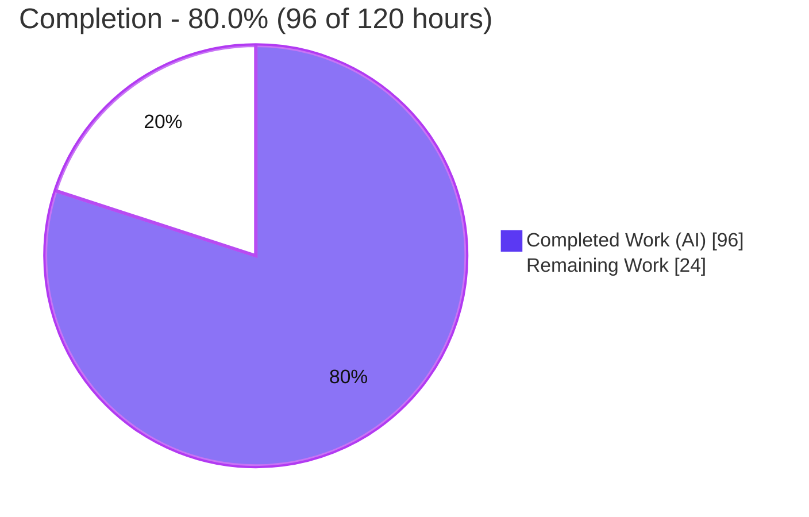
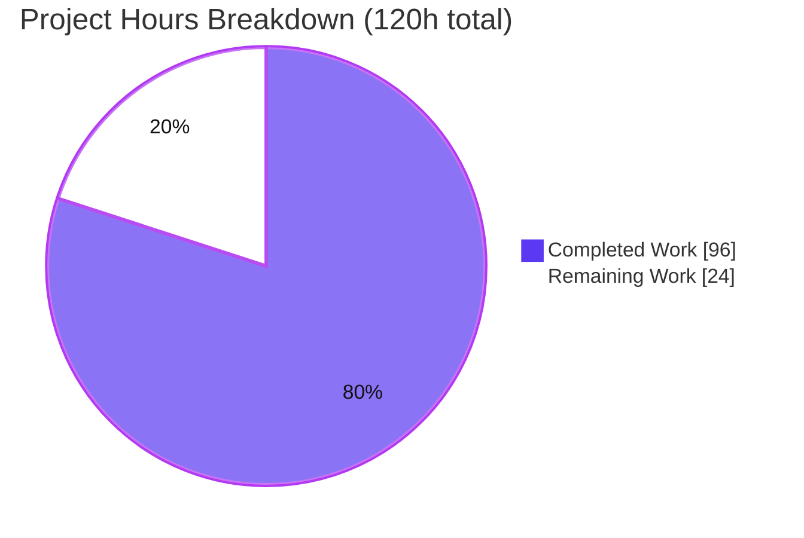
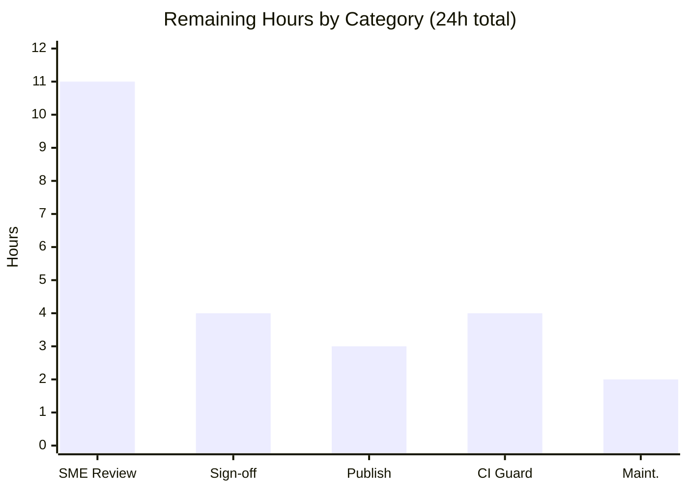
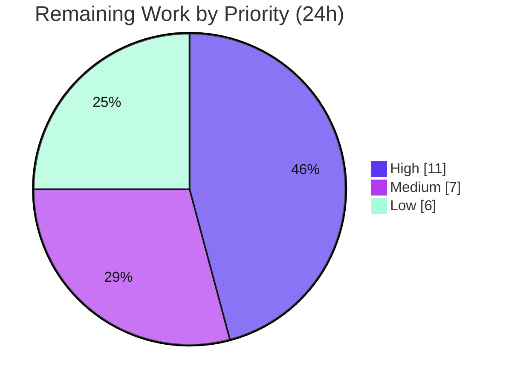

# Blitzy Project Guide — Trust-Mesh Technical Specification (Kubernetes × Vault × OpenTelemetry)

> **Document type.** Analytical Technical Specification (trust-boundary / threat-model style). **Not** a deployable platform. Per the Agent Action Plan (AAP §0.6/§0.9), the corpus is an analytical construct that is **not** built, deployed, or executed; no software dependencies were added; validation is read-only and evidentiary.

---

## 1. Executive Summary

### 1.1 Project Overview

This project delivers an analytical **Trust-Mesh Technical Specification** that reconstructs — exclusively from corpus evidence — how trust, authority, identity, credentials, secrets, permissions, and privileged access propagate across three pinned Git submodules treated as one enterprise trust mesh: **Kubernetes** (Runtime Identity Authority), **Vault** (Secrets & Credentials Authority), and the **OpenTelemetry Collector** (Service Relationship & Telemetry Authority). The deliverable reconstructs an eight-link trust chain, catalogs every cross-domain trust seam with a full attribute and liability analysis, and surfaces hidden dependencies, audit blind spots, and documentation-vs-implementation contradictions. Target consumers are platform-security architects assessing aggregate trust risk across these domains.

### 1.2 Completion Status



> **Legend.** Completed = Dark Blue `#5B39F3` · Remaining = White `#FFFFFF` (bordered in Violet `#B23AF2` for visibility).

| Metric | Hours |
|--------|-------|
| **Total Hours** | **120** |
| Completed Hours (AI + Manual) | 96 (96 AI · 0 manual) |
| Remaining Hours | 24 |
| **Percent Complete** | **80.0%** |

Completion is computed by the AAP-scoped hours method: `Completed ÷ (Completed + Remaining) = 96 ÷ 120 = 80.0%`. The denominator includes only AAP-defined authoring deliverables and standard path-to-production activities.

### 1.3 Key Accomplishments

- [x] Delivered the complete analytical specification `TECHNICAL_SPECIFICATION.md` (760 lines, ~9,300 words), sections **§1–§9**.
- [x] Cataloged **3 of 3** trust domains with authority roles and reconstructed **8 of 8** trust-chain links against implementation evidence.
- [x] Documented **5 cross-domain seams (S1–S5)**, each with the full **11-attribute** set plus a paired **liability** analysis.
- [x] Surfaced high-value findings: **audit blind spots** (§6.4.1) and **documentation-vs-implementation contradictions** (§6.4.2).
- [x] Authored **9 Mermaid diagrams** (trust-chain spine, seam sequences, Vault→K8s state, RBAC decision, liability cascade, domain/seam map, collector graph).
- [x] Applied **370 inline `[path:locator]` citations** and **170 evidence-classification tags** (97 Directly Observed / 67 Inferred / 6 Documented Assumption).
- [x] Built a **16-entry traceability matrix** (F-001..F-016) resolving all six required Feature IDs (F-003, F-007, F-010, F-011, F-012, F-016).
- [x] Passed all autonomous documentation-validation gates (citations 354/354, line-bounds 257/257, diagrams 9/9, clean full-document render) with **zero unresolved issues**.
- [x] Preserved submodule immutability — `vault/`, `kubernetes/`, `opentelemetry/` each report **0 modified files**.

### 1.4 Critical Unresolved Issues

No defects, compilation failures, or broken validations remain in the deliverable. The items below are **inherent human-in-the-loop checkpoints** for an AI-authored security analysis, not unresolved defects.

| Issue | Impact | Owner | ETA |
|-------|--------|-------|-----|
| Analytical security claims not yet validated by a human SME | Conclusions should not be relied upon for production trust decisions until reviewed | Security Architect | ~11h (see §2.2 / §9) |
| Central seam S1 depends on out-of-corpus server-side JWT verification (`vault-plugin-auth-kubernetes`) | The verification logic is not directly evidenced; the spec flags it as Inferred | Security Architect | Within SME review |
| Deliverable not yet published to a shared host | Stakeholders cannot consume diagrams without a Mermaid-capable host | Tech Writer / Platform | ~3h |

### 1.5 Access Issues

No access issues identified. All evidence was read on the local working copy at `/tmp/blitzy/blitzy-bank-system/...`; all three submodules are populated at their pinned commits (kubernetes `14f9f7e`, opentelemetry `07f953b`, vault `0bebe00`); the branch and Git history are fully accessible. No external credentials, service accounts, or third-party APIs are required for this analytical, read-only task.

| System / Resource | Type of Access | Issue Description | Resolution Status | Owner |
|-------------------|----------------|-------------------|-------------------|-------|
| Corpus & submodules | Read (filesystem/Git) | None — all populated at pinned commits | ✅ No issue | — |
| External APIs / cloud / CI secrets | N/A | Not required (analytical construct, no runtime) | ✅ Not applicable | — |

### 1.6 Recommended Next Steps

1. **[High]** Have a security architect review and accept the seam analyses (S1–S5), liability cascades, and high-value findings, weighing the out-of-corpus S1 caveat.
2. **[High]** Adjudicate the audit blind spots (§6.4.1) and documentation-vs-implementation contradictions (§6.4.2) — accept or assign an owner for each.
3. **[Medium]** Walk stakeholders through the trust-mesh reconstruction, incorporate feedback, and obtain formal sign-off.
4. **[Medium]** Publish the specification to a Mermaid-capable Markdown host and verify all 9 diagrams render.
5. **[Low]** Add a CI citation-drift/diagram-render guard against the pinned submodule commits and a re-validation runbook.

---

## 2. Project Hours Breakdown

### 2.1 Completed Work Detail

Every component traces to an AAP-specified deliverable and is present in the committed `TECHNICAL_SPECIFICATION.md`.

| Component | Hours | Description |
|-----------|-------|-------------|
| Corpus evidence discovery & cross-domain trust analysis | 16 | Read-only navigation/analysis of ~21,100 Go files across Vault, Kubernetes, OpenTelemetry to locate & interpret the load-bearing trust artifacts (auth methods, secret engines, RBAC, identity, audit, extensionauth) [AAP §0.2.2] |
| §1 Introduction + license/provenance boundaries | 4 | Corpus overview, three authority roles, scope & library boundaries, BUSL-1.1 vs Apache-2.0 provenance |
| §2 Requirements & Traceability Matrix | 5 | 16 analytical Feature IDs (F-001..F-016), each mapped to evidence anchors + evidence class |
| §3 Technology Stack & version surfacing | 3 | Go runtime versions (1.26.3 / 1.26.0 / 1.25.0), trust anchors/pinning, auth surfaces, toolchain |
| §4 Process Flows + seam diagrams | 12 | Master 8-link workflow + Identity→Secret & Service↔Downstream sequences, Vault→K8s state, RBAC decision, liability cascade |
| §5 System Architecture | 5 | Domains as components, domain/seam map, collector service-relationship graph, decisions, cross-cutting concerns |
| §6 Detailed Architecture incl. §6.4 trust-seam core | 18 | Secret lifecycle, telemetry trust, per-seam catalog S1–S5 (11 attributes each) + paired liability analysis, audit blind spots, contradictions |
| §7 UI Surfaces + §8 Infrastructure | 4 | Diagnostic surface trust boundaries + authenticator config schema; analytical containerization, CI/CD, cosign provenance (F-016) |
| §9 Appendices | 3 | Evidence legend, domain quick-reference, glossary, acronyms, corpus references |
| Diagram authoring & offline render verification | 4 | 9 Mermaid diagrams authored, labeled, and render-verified |
| Citation discipline & line-exact verification | 7 | 370 inline `[path:locator]` citations bound to exact source lines |
| Evidence classification scheme | 3 | 170 inline tags (Directly Observed / Inferred / Documented Assumption) on every material claim |
| QA / review / revision cycles | 6 | Three documented revision passes (code-review 130/130, QA 30/28, hygiene) per Git history |
| Blitzy autonomous validation | 6 | Tooling setup + 4 documentation-validation gates (citations, structure, diagram render, full-doc render, non-fabrication) |
| **Total Completed** | **96** | **= Completed Hours in §1.2** |

### 2.2 Remaining Work Detail

Each category is path-to-production (productionizing the deliverable), not an unfinished AAP authoring item.

| Category | Hours | Priority |
|----------|-------|----------|
| Human security-architect / SME review & acceptance of analytical claims (S1–S5 seams, liability cascades, high-value findings, out-of-corpus caveats) | 11 | High |
| Stakeholder walkthrough, feedback incorporation & formal sign-off | 4 | Medium |
| Publishing / hosting to a Mermaid-capable Markdown host + verify diagram rendering | 3 | Medium |
| CI citation-drift + diagram-render guard against pinned submodule commits | 4 | Low |
| Documentation maintenance: align offline-render Mermaid version note + re-validation runbook | 2 | Low |
| **Total Remaining** | **24** | **= Remaining Hours in §1.2 = §7 pie "Remaining Work"** |

### 2.3 Hours Reconciliation

- Total Project Hours = Completed (96) + Remaining (24) = **120**.
- Completion % = 96 ÷ 120 = **80.0%**.
- §2.1 total (96) = §1.2 Completed. §2.2 total (24) = §1.2 Remaining = §7 pie "Remaining Work". §2.1 + §2.2 = 120 = §1.2 Total. ✔

---

## 3. Test Results

This is a documentation-production task, so the standard test gates were mapped to documentation-validation equivalents. **All entries originate from Blitzy's autonomous validation logs for this project** and were independently re-confirmed on the working copy where noted.

| Test Category | Framework / Tool | Total Checks | Passed | Failed | Coverage % | Notes |
|---------------|------------------|--------------|--------|--------|-----------|-------|
| Citation existence | Custom read-only path verifier | 354 | 354 | 0 | 100% | Every cited corpus path exists on disk |
| Citation line-range bounds | Custom verifier | 257 | 257 | 0 | 100% | All line-style locators within cited-file bounds |
| Citation content spot-checks | Scripted exact-line match | 50 | 50 | 0 | 100% | Load-bearing citations matched exact lines across all 3 domains |
| Directory-inventory accuracy | Filesystem enumeration | 4 | 4 | 0 | 100% | credential=9, logical=10, auto-auth=13, rbac=6 — all exact |
| Version accuracy | `go.mod` assertion | 3 | 3 | 0 | 100% | Vault 1.26.3, Kubernetes 1.26.0, OpenTelemetry 1.25.0 |
| Mermaid diagram render | @mermaid-js/mermaid-cli (mmdc 11.15.0) | 9 | 9 | 0 | 100% | All diagrams render to SVG/PNG, 0 syntax errors |
| Evidence-classification audit | Custom tag scan | 170 | 170 | 0 | 100% | 97 Directly Observed / 67 Inferred / 6 Documented Assumption |
| Full-document render | python-markdown 3.10.2 | 1 | 1 | 0 | 100% | Clean HTML (108 KB, 25 tables), no broken constructs |
| Markdown well-formedness | markdownlint-cli2 + custom | 35 | 35 | 0 | 100% | 11 fence pairs balanced, 0 header-level jumps, 25 tables consistent, 9 ToC anchors resolve |
| Structure completeness | Custom structure check | 1 | 1 | 0 | 100% | §1–§9 present; traceability F-001..F-016 incl. all 6 required |
| Non-fabrication audit | Custom scan | 1 | 1 | 0 | 100% | 0 fabricated runtime/deploy claims; 7 analytical-construct disclaimers; 0 TODO/stub markers |
| **Totals** | — | **884** | **884** | **0** | **100%** | Zero failures across all autonomous documentation-validation gates |

> **Note on "Coverage %".** For a documentation deliverable, coverage denotes the proportion of the relevant surface exercised by each check (e.g., 354 of 354 cited paths verified). It is not source-code line coverage — no application code was authored or executed.

---

## 4. Runtime Validation & UI Verification

The corpus is an analytical construct with **no runtime** (AAP §0.9), so "runtime" here means render-time validation of the document and its diagrams. There is no application UI to verify.

**Document render runtime**

- ✅ **Operational** — Full document renders to clean HTML (108 KB, 25 tables) via python-markdown; no broken constructs.
- ✅ **Operational** — All **9/9** Mermaid diagrams render to SVG/PNG via mmdc (0 errors); output validated as well-formed XML.
- ✅ **Operational** — All **9/9** Table-of-Contents anchors resolve to their target headings.

**UI verification**

- ⚠ **Not applicable** — The three domains are backend infrastructure (Go) with no application UI. §7 documents only diagnostic surfaces: Kubernetes exposes no UI; Vault's UI is treated as a diagnostic surface; OpenTelemetry exposes a configuration contract, not a UI.

**API / integration outcomes**

- ⚠ **Not applicable (by design)** — No live APIs were invoked; per AAP no cluster, Vault server, or Collector is started. The documented cross-domain "integrations" are analytical seams reconstructed from source, not executed calls.
- ✅ **Operational (analytical)** — The central seam S1 (Kubernetes SA token → Vault token) is fully traced to source (`vault/command/agentproxyshared/helpers.go`, `.../auth/kubernetes/kubernetes.go`); the out-of-corpus server-side verification dependency is explicitly disclosed.

---

## 5. Compliance & Quality Review

Cross-maps the AAP's binding rules (§0.10) and coverage targets (§0.7) to Blitzy's quality benchmarks. Status reflects autonomous validation findings.

| Benchmark (AAP basis) | Requirement | Status | Evidence / Progress |
|-----------------------|-------------|--------|---------------------|
| Corpus-evidence-only (§0.10) | No claim sourced outside the corpus | ✅ Pass | 370 citations, all corpus-relative |
| Cite every system claim (§0.9) | Inline `[path:locator]` on each claim | ✅ Pass | 370 citations; 354/354 exist; 257/257 in-bounds |
| Evidence classification (§0.10) | Tag every material claim | ✅ Pass | 170 tags (97/67/6) |
| Prefer implementation over docs (§0.10) | Record conflicts as findings | ✅ Pass | §6.4.2 contradictions documented |
| Do-not-invent / analytical construct (§0.10) | No fabricated runtime/deploy/integration | ✅ Pass | Non-fabrication scan clean; 7 disclaimers |
| Organize around trust propagation (§0.10) | Chain/seam-centric, not feature-centric | ✅ Pass | 8-link spine + S1–S5 seam organization |
| Full per-seam attribute set (§0.7.1) | 11 attributes per seam | ✅ Pass | S1–S5 each carry all 11 |
| Liability per seam (§0.7.1) | One liability path per seam | ✅ Pass | 6-aspect liability table per seam |
| High-value findings (§0.10) | Hidden deps, blind spots, contradictions | ✅ Pass | §6.4.1 + §6.4.2 |
| Trust domains documented (§0.7.1) | 3 of 3 | ✅ Pass | Kubernetes, Vault, OpenTelemetry |
| Trust-chain links (§0.7.1) | 8 of 8 reconstructed | ✅ Pass | §4.2 master workflow |
| Required Feature IDs (§0.5.4) | F-003,007,010,011,012,016 | ✅ Pass | §2.5 traceability matrix |
| Diagram set (§0.7.3) | Minimum set authored | ✅ Pass | 9 diagrams ≥ planned set |
| Submodule immutability (§0.8.2) | No edits inside submodules | ✅ Pass | 0 modified files in each |
| Library boundaries (§0.10) | Only api/sdk/staging as import surfaces | ✅ Pass | §1.3 caveat present |

**Fixes applied during autonomous validation**

- Resolved markdownlint **MD012** (multiple trailing blank lines) by normalizing to a single terminating newline (commit `c75a553`; content otherwise byte-for-byte identical).
- Two earlier substantive passes (`5d421d8` code-review, `0efa3e0` QA) refined ~half the document and resolved QA findings.

**Outstanding (waived with rationale)**

- **MD013** (80-char line length) and **MD060** (table pipe spacing) intentionally waived: no project markdownlint config exists; both are cosmetic and do not affect rendering (25 tables and long citations render correctly).

---

## 6. Risk Assessment

No risk is a blocking defect in the deliverable. Risks concern reliance on, and productionization of, an AI-authored security analysis.

| Risk | Category | Severity | Probability | Mitigation | Status |
|------|----------|----------|-------------|------------|--------|
| **S1** Reliance on Inferred/Assumption claims before SME validation (67 + 6 such claims about trust/liability/compromise) | Security | High | Medium | Mandatory human security-architect review; inline evidence-classification already flags uncertainty | Open — addressed by High-priority remaining task |
| **S2** Out-of-corpus validation gap at central seam S1 (Vault k8s-auth server-side JWT verification lives in `vault-plugin-auth-kubernetes v0.24.1`, not in corpus) | Security | Medium | Medium | Spec classifies as Inferred/out-of-corpus; weigh during SME review | Disclosed / Open |
| **S3** High-value findings (audit blind spots, contradictions) need an action owner | Security | Medium | Low | Route each finding to a security owner during review | Open — informational |
| **T1** Citation drift if pinned submodules are re-pinned (370 line-exact citations) | Technical | Medium | Low | Pin discipline + optional CI citation-drift guard | Mitigated by design (currently pinned) |
| **T2** Mermaid diagrams render only in Mermaid-capable hosts | Technical | Low | Medium | Offline SVG/PNG via mmdc (9/9 verified) or publish to a Mermaid host | Mitigated |
| **T3** Analytical snapshot may stale if upstream code evolves | Technical | Low | Low | Re-validation runbook (Low remaining task) | Open (low) |
| **O1** No documentation build/publish pipeline at corpus root | Operational | Low | High | Lightweight manual publishing task (Medium remaining) | Open — path-to-production |
| **O2** Render-evidence PNGs are untracked (correctly git-excluded) | Operational | Low | Low | Re-render on demand via documented mmdc commands | Accepted |
| **I1** Reader could mistake the analytical construct for a deployed integration | Integration | Medium | Low | 7 analytical-construct disclaimers + do-not-invent discipline | Mitigated by design |
| **I2** Over-generalizing integration beyond supported import surfaces | Integration | Low | Low | §1.3 library-boundary caveat | Mitigated |

---

## 7. Visual Project Status



> Completed = Dark Blue `#5B39F3` (96h) · Remaining = White `#FFFFFF` (24h). **Remaining Work (24) equals §1.2 Remaining Hours and the §2.2 Hours total.**

**Remaining hours by category**



**Remaining work by priority**



---

## 8. Summary & Recommendations

**Achievements.** The project delivers a complete, evidence-grounded trust-mesh Technical Specification. All AAP authoring scope is done and autonomously validated with **zero unresolved issues**: 3/3 trust domains, 8/8 chain links, 5 fully-attributed seams with liability analyses, high-value findings, 370 verified citations, 170 evidence tags, 9 rendered diagrams, and a 16-entry traceability matrix — all while preserving submodule immutability.

**Remaining gaps.** The project is **80.0% complete** (96 of 120 hours). The remaining **24 hours** are path-to-production, dominated by the **human security-architect review (11h)** that an AI analysis cannot self-perform, followed by stakeholder sign-off, publishing, and optional CI hardening.

**Critical path to production.** (1) SME review & acceptance of the security analysis → (2) adjudicate high-value findings → (3) stakeholder sign-off → (4) publish to a Mermaid-capable host. Optional CI/maintenance hardening can follow release.

**Success metrics.** Citation accuracy 354/354; diagram render 9/9; document render clean; structure §1–§9 complete; required Feature IDs all resolved; 0 submodule modifications.

**Production-readiness assessment.** The deliverable is **documentation-production-ready** (drafted, self-validated, internally consistent). It is **not yet production-accepted**: an AI-authored security analysis requires human SME validation before its conclusions are relied upon for trust decisions. Recommended status: **Approve for human security review**, not for unconditional production reliance.

| Metric | Value |
|--------|-------|
| Completion | 80.0% (96 / 120 h) |
| Unresolved defects | 0 |
| Highest-priority remaining item | Human SME security review (11h) |
| Blocking risks | 0 |

---

## 9. Development Guide

This guide explains how to **view, render, and verify** the specification. There is **no build/run step** — per AAP §0.9 no documentation generator exists; the commands below are optional aids. All commands were tested on the validation host.

### 9.1 System Prerequisites

| Tool | Version (tested) | Purpose |
|------|------------------|---------|
| Git (+ Git LFS) | 2.51.0 | Clone repo and submodules at pinned commits |
| Any Markdown viewer with Mermaid | — | Primary way to read the spec with diagrams |
| Node.js + npm | 20.x / 11.x | Optional: offline diagram rendering via mermaid-cli |
| @mermaid-js/mermaid-cli (`mmdc`) | 11.15.0 | Optional: render Mermaid blocks to SVG/PNG |
| Google Chrome | 149.x | Required by mmdc/puppeteer in headless containers |
| Python 3 + `markdown` | 3.13 / 3.10.2 | Optional: render the whole doc to HTML |

### 9.2 Environment Setup

The 370 citations reference exact lines inside the submodules, so the submodules must be populated at their pinned commits.

```bash
# Clone with submodules (or initialize an existing clone)
git clone --recurse-submodules <repo-url>
cd <repo>
git submodule update --init --recursive

# Confirm the pinned commits the citations bind to
git submodule status
#  14f9f7e... kubernetes   07f953b... opentelemetry   0bebe00... vault
```

### 9.3 Viewing the Specification

```bash
# Open in any Mermaid-capable Markdown host (GitHub, VS Code + Mermaid, etc.)
# Or inspect structure from the shell:
grep -E '^## [0-9]\. ' TECHNICAL_SPECIFICATION.md   # lists the 9 sections
```

### 9.4 Offline Diagram Rendering (optional)

`mmdc` ships without a bundled browser in this environment; point it at system Chrome.

```bash
# One-time tooling (not committed; adds no project dependency)
npm install -g @mermaid-js/mermaid-cli

# Puppeteer config for headless container Chrome
printf '{ "args": ["--no-sandbox", "--disable-dev-shm-usage"] }\n' > puppeteer.json
export PUPPETEER_EXECUTABLE_PATH="$(command -v google-chrome)"

# Extract every ```mermaid block to d1.mmd … d9.mmd
python3 - <<'PY'
import re
t = open("TECHNICAL_SPECIFICATION.md", encoding="utf-8").read()
for i, b in enumerate(re.findall(r"```mermaid\n(.*?)```", t, re.S), 1):
    open(f"d{i}.mmd", "w").write(b)
print("extracted", i, "diagrams")
PY

# Render each diagram to SVG
for f in d*.mmd; do mmdc -i "$f" -o "${f%.mmd}.svg" -p puppeteer.json; done
# Expected: 9 SVGs produced, 0 errors
```

### 9.5 Full-Document HTML Render (optional)

```bash
python3 - <<'PY'
import markdown
src = open("TECHNICAL_SPECIFICATION.md", encoding="utf-8").read()
html = markdown.markdown(src, extensions=["tables", "fenced_code", "toc"])
open("spec.html", "w", encoding="utf-8").write(html)
print("HTML bytes:", len(html), "| tables:", html.count("<table>"))
# Expected: ~108000 bytes | tables: 25
PY
```

### 9.6 Verification

```bash
# Structure: expect 9
grep -cE '^## [0-9]\. ' TECHNICAL_SPECIFICATION.md

# Diagrams: expect 9 ; Evidence tags: expect 170
grep -c '```mermaid' TECHNICAL_SPECIFICATION.md
grep -oE '\[(Directly Observed|Inferred|Documented Assumption)\]' TECHNICAL_SPECIFICATION.md | wc -l

# Citation existence sampler (cited .go/.md/.yaml files must exist)
python3 - <<'PY'
import re, os
t = open("TECHNICAL_SPECIFICATION.md", encoding="utf-8").read()
toks = re.findall(r'`([A-Za-z0-9._][A-Za-z0-9._/\-]*\.(?:go|md|mod|yaml|yml))(?::L?\d[\d\-]*)?`', t)
seen, miss = [], 0
for p in toks:
    if p in seen: continue
    seen.append(p)
    if not os.path.exists(p): miss += 1; print("MISSING:", p)
print(f"{len(seen)-miss}/{len(seen)} distinct cited files exist")
PY
```

### 9.7 Example Usage — Trace a Trust Seam

To follow the central seam end-to-end: start at **§2.5 Traceability Matrix** (find **F-007 / Seam S1**) → jump to **§4.4** for the Identity→Secret sequence diagram → read **§6.4 Seam S1** for the 11-attribute catalog and liability analysis. This shows a Kubernetes service-account JWT being exchanged for a Vault token.

### 9.8 Troubleshooting

- **`mmdc` fails with an async/cli error:** the bundled browser is missing. Set `export PUPPETEER_EXECUTABLE_PATH="$(command -v google-chrome)"` and pass `puppeteer.json` with `--no-sandbox` (see §9.4).
- **Diagrams show as raw ```mermaid fences:** the viewer lacks Mermaid support — use a Mermaid-capable host or render offline (§9.4).
- **Citation files "missing":** submodules not initialized — run `git submodule update --init --recursive` (§9.2).
- **HTML render lacks tables:** include the `tables` and `fenced_code` extensions (§9.5).

---

## 10. Appendices

### A. Command Reference

| Command | Purpose |
|---------|---------|
| `git submodule update --init --recursive` | Populate submodules at pinned commits |
| `git submodule status` | Show pinned commits citations bind to |
| `grep -cE '^## [0-9]\. ' TECHNICAL_SPECIFICATION.md` | Count sections (expect 9) |
| `grep -c '```mermaid' TECHNICAL_SPECIFICATION.md` | Count diagrams (expect 9) |
| `mmdc -i d.mmd -o d.svg -p puppeteer.json` | Render a Mermaid block to SVG |
| `python3 -c "import markdown; ..."` | Render full doc to HTML |

### B. Port Reference

Not applicable — the corpus is an analytical construct with **no runtime services or network ports** (AAP §0.9). Nothing is started or listened on.

### C. Key File Locations

| Path | Role |
|------|------|
| `TECHNICAL_SPECIFICATION.md` | The deliverable (§1–§9) |
| `README.md`, `Manifest.md` | Corpus framing / trust-domain taxonomy (reference) |
| `docs/docs/TRUST_PROPAGATION_HYPOTHESIS.md` | 8-link trust-chain hypothesis (reference) |
| `.gitmodules` | Submodule provenance (paths/URLs) |
| `vault/command/agentproxyshared/helpers.go` | Central seam S1 evidence (K8s token → Vault) |
| `kubernetes/plugin/pkg/auth/authorizer/rbac/rbac.go` | RBAC authorization-decision evidence |
| `opentelemetry/extension/extensionauth/doc.go` | Service↔Service auth contract evidence |
| `blitzy/screenshots/` | Diagram render-evidence montages (untracked) |

### D. Technology Versions

| Item | Version | Source |
|------|---------|--------|
| Vault (Go toolchain) | go 1.26.3 | `vault/go.mod` |
| Kubernetes (Go toolchain) | go 1.26.0 | `kubernetes/go.mod` |
| OpenTelemetry Collector (Go toolchain) | go 1.25.0 | `opentelemetry/go.mod` |
| Mermaid (recommended offline) | 11.14.0 (validation used 11.15.0) | AAP §0.6.1 / validation logs |
| python-markdown (render aid) | 3.10.2 | validation host |
| Vault k8s-auth backend (out-of-corpus) | `vault-plugin-auth-kubernetes v0.24.1` | `vault/go.mod` (dependency) |

### E. Environment Variable Reference

| Variable | Used by | Value / Purpose |
|----------|---------|-----------------|
| `PUPPETEER_EXECUTABLE_PATH` | mmdc / puppeteer | Path to system Chrome for headless diagram render |
| `CI` | npm tooling | Set `true` to keep tooling non-interactive |
| `DEBIAN_FRONTEND` | apt (if installing tools) | Set `noninteractive` |

> The specification itself defines **no** application environment variables — it is documentation, not a service.

### F. Developer Tools Guide

- **mermaid-cli (`mmdc`)** — renders Mermaid blocks to SVG/PNG; requires a Chrome path in containers (§9.4).
- **python-markdown** — converts the spec to HTML with `tables`, `fenced_code`, `toc` extensions (§9.5).
- **markdownlint-cli2** — optional well-formedness linting; note MD013/MD060 are intentionally waived (§5).

### G. Glossary

| Term | Definition |
|------|------------|
| Trust mesh | The three domains analyzed as a single combined trust system rather than independent products |
| Trust domain | A component that can independently establish, validate, grant, deny, propagate, or rely upon trust |
| Trust seam | A cross-domain interaction where one domain trusts an assertion made under another's authority (S1–S5) |
| Liability propagation | How authority/risk granted at one seam cascades to dependent systems if an assertion is forged/compromised |
| Authority role | The active mesh role assigned to each domain (Runtime Identity / Secrets & Credentials / Service Relationship & Telemetry) |
| Evidence class | Directly Observed, Inferred, or Documented Assumption — the confidence tag on each claim |
| Path-to-production | Standard activities (human review, sign-off, publishing) to take a validated deliverable to accepted/published |
